# hx_clog

[English](README.md) | [中文](README.zh-CN.md)

A portable logging framework for **C / C++11** projects. The core public API keeps a stable C ABI, making it suitable for embedded software, services, desktop clients, tools, games, audio/video applications, and cross-language bindings. The recommended integration path is the C API; the C++11 layer is a lightweight RAII wrapper on top of the same C API and does not affect pure C users.

[](https://github.com/HuangX666/hx_clog/actions/workflows/ci.yml)
[](CMakeLists.txt)
[](include/hx_clog.h)
[](include/hx_clog_cpp.hpp)
[](.github/workflows/ci.yml)
[](LICENSE)

## Project overview

| Item | Description |
| --- | --- |
| Core language | C99, public C ABI |
| Optional wrapper | C++11 RAII wrapper |
| Build system | CMake 3.16+ |
| Supported platforms | Windows, Linux, macOS; CI smoke builds cover Android arm64-v8a / iOS arm64 |
| Output targets | Console, File, Rotate File, Syslog, Windows Event Log, Android logcat, Apple os_log, custom callback |
| Write modes | Sync / async, with blocking, drop-new, and drop-old queue overflow strategies |
| Formatting | pattern, custom formatter, JSON output |
| Reliability | File rotation, startup rotation, interval rotation, crash logs, last-N log ring buffer |
| Extension points | sink, formatter, allocator, named logger, thread-local context |

## CI/CD status

The current `master` branch is connected to GitHub Actions. The CI badge at the top of this README shows the test result in real time.

| Workflow | Coverage |
| --- | --- |
| `build-and-test` | Ubuntu / Windows / macOS, Debug / Release, full examples + tests build |
| `ctest` | format, rotate, large line, features, rotate time, crash, async, C++11 wrapper, UTF-8 paths |
| `linux-arm` | Native ubuntu-24.04-arm (aarch64) build and full test run |
| `sanitizers` | ASan+UBSan and TSan full-test builds |
| `options-matrix` | `ASYNC=OFF` / `CRASH=OFF` / `ZLIB=OFF` / shared and other compile-gating combinations |
| `packaging-smoke` | Linux Release install-package smoke test for exported CMake package and public headers |
| `mobile-smoke` | Android arm64-v8a and iOS arm64 cross-compile smoke builds with crash handler enabled |
| Linux syslog check | Builds the syslog sink path with `HX_CLOG_ENABLE_SYSLOG=ON` |

## 1.1.0 change summary

**Fixes**

- `hx_get_tid` no longer hardcodes the x86-64 syscall number, so thread IDs are correct on ARM Linux / Android (`SYS_gettid`).
- All Windows file operations now use UTF-16 wide-character APIs, so UTF-8 log directories and file names, including Chinese names, work under any system codepage (`test_utf8path` covers this).
- Crash handling is now signal-safe: `popen`/`addr2line` were removed; symbolization only uses `dladdr` (module + offset, offline resolution); the Windows filter no longer calls `hx_clog_flush()` because the crashing thread may hold a lock and deadlock itself; POSIX adds `sigaltstack`, so stack overflow can still produce a report.
- Async engine shutdown races were fixed: synchronization primitives are created once and never destroyed, `running/stop` are checked under the lock, and oversized slot buffers shrink when reused.
- `hx_clog_init`, `hx_clog_shutdown`, and `hx_clog_reconfigure` are serialized, making concurrent calls safe.
- The hot path no longer locks just to copy the pattern; it uses a thread-local format cache refreshed lazily by generation.
- Rotation cleanup no longer uses an approximately 140 KB static buffer, improving thread safety and avoiding resident memory; daily rotation archive names are inferred from the file-open date, avoiding wrong dates after multi-day idle gaps.
- JSON mode retries long-message capacity based on escaped expansion (6x), so it no longer truncates into invalid JSON.
- Timed flush uses a monotonic clock, so system clock rollback no longer stalls async flushing.
- macOS `HX_CLOG_ENABLE_SYSLOG=ON` now truly takes effect; CMake switches such as `ENABLE_COLOR/STACKTRACE/SYMBOLIZE/MINIDUMP` are wired into code gates and defaults.

**New**

- Per-sink format overrides: `hx_clog_set_sink_pattern` / `hx_clog_set_sink_format_mode` (works in sync and async mode; for example, file sink uses pattern while callback sink uses JSON).
- Internal error callback `hx_clog_set_error_handler` for sink creation failures, file open/rotation failures, and throttled async-drop reporting.
- Duplicate log suppression `hx_clog_set_duplicate_suppression` (`"last message repeated N times"`).
- Crash report user callback `hx_clog_set_crash_callback`, for appending business context to the report; it must be async-signal-safe.
- Aligned interval rotation `cfg.rotate_align` (for example, 3600 means rotate on the hour); `.gz` backup count cap `cfg.max_compressed_files` (0 = reuse `max_backup_files`).
- Android / iOS crash handling (Android uses `_Unwind_Backtrace`), and mobile CI no longer disables crash.
- Complete `hx_clog_after_fork_child`: rebuilds all internal locks and restarts the async worker.
- pkg-config file (`hx_clog.pc`); C++ wrapper support for `{{`/`}}` escaping and C++20 `std::source_location`.

> Note: `hx_clog_config_t` gained `rotate_align` / `max_compressed_files` at the end. Source compatibility is preserved when callers always call `hx_clog_config_default()` first, but binary users must rebuild.

## Feature highlights

| Capability | Description |
| --- | --- |
| C first | Public API uses a C ABI, making it easy to integrate from C, C++, Rust, Go, Python FFI, or extension layers |
| Cross-platform | Windows / Linux / macOS CI coverage, with platform-specific sinks enabled through conditional compilation |
| Sync and async | Small tools can use sync mode; services can use async queues to reduce business-thread I/O blocking |
| Multiple loggers | Supports default logger, named loggers, independent logger levels, and `HX_LOG_NAMED_*` macros |
| Context logs | Supports thread-local context; `%x` emits it in pattern mode and JSON carries it automatically |
| Multiple formats | Built-in pattern and JSON formatters, plus custom formatter registration |
| Multiple output targets | Console, file, rotating file, system logs, and custom callback sinks |
| File rotation | Supports size, daily, interval, and startup rotation; old backups beyond the retention count can be compressed to `.gz` with zlib |
| Crash logs | Supports SEH / POSIX signal capture, stack traces, register dumps, and recent-log protection |
| Runtime configuration | Supports runtime changes to level, pattern, formatter, format mode, and rebuilding built-in sinks |

## Quick start

```sh
cmake -S . -B build -DHX_CLOG_BUILD_EXAMPLES=ON -DHX_CLOG_BUILD_TESTS=ON
cmake --build build --config Debug --parallel
ctest --test-dir build -C Debug --output-on-failure
```

### Minimal C example

```c
#include "hx_clog.h"

int main(void) {
    hx_clog_config_t cfg;
    hx_clog_config_default(&cfg);

    cfg.log_dir = "./logs";
    cfg.file_name = "app.log";
    cfg.level = HX_CLOG_LEVEL_INFO;
    cfg.mode = HX_CLOG_MODE_ASYNC;

    if (hx_clog_init(&cfg) != HX_CLOG_OK) {
        return 1;
    }

    hx_clog_context_put("request_id", "42");
    HX_LOG_INFO("service started: port=%d", 8080);
    HX_LOG_NAMED_WARN("net", "retry connect to %s", "127.0.0.1");

    hx_clog_shutdown();
    return 0;
}
```

### Minimal C++11 example

```cpp
#include "hx_clog_cpp.hpp"

int main() {
    hx::clog::Config config;
    config.dir("./logs")
          .file("cpp_demo.log")
          .level(HX_CLOG_LEVEL_DEBUG);

    hx::clog::Logger logger(config);
    if (!logger.ok()) {
        return 1;
    }

    logger.context("module", "demo");
    logger.infof("hello {}, value={}", "hx_clog", 7);
    return 0;
}
```

## Documentation

| Topic | English | Chinese |
| --- | --- | --- |
| README | [README.md](README.md) | [README.zh-CN.md](README.zh-CN.md) |
| API, logger, formatter, sink, rotation, environment variables | [docs/api.md](docs/api.md) | [docs/zh-CN/api.md](docs/zh-CN/api.md) |
| Module layout, write path, threading model, memory strategy | [docs/design.md](docs/design.md) | [docs/zh-CN/design.md](docs/zh-CN/design.md) |
| Crash handler, minidump, stacktrace, last-N logs | [docs/crash.md](docs/crash.md) | [docs/zh-CN/crash.md](docs/zh-CN/crash.md) |
| GitHub Actions, platform matrix, local verification commands | [docs/ci.md](docs/ci.md) | [docs/zh-CN/ci.md](docs/zh-CN/ci.md) |

---

The complete detailed design notes are kept below for architecture, API, and implementation reference.

## 1. Project positioning

`hx_clog` is a cross-platform logging framework for C / C++11 projects. Its goal is to provide unified, reliable, and easy-to-adopt logging for embedded systems, services, desktop clients, tools, games, audio/video applications, and similar scenarios.

It should provide the following characteristics:

| Capability | Description |
| --- | --- |
| C first | Core interfaces use a C ABI, making them easy to call from C, C++, Rust, Go, Python extension layers, and similar integrations |
| Cross-platform | Supports Windows, Linux, and macOS, with reserved adaptation points for Android, iOS, and embedded platforms |
| Sync logging | The calling thread writes logs directly; simple and reliable, suitable for small tools and debugging |
| Async logging | A background thread writes in batches, reducing business-thread I/O blocking |
| Log rotation | Supports rotation by file size, date, and startup count |
| Multiple outputs | Console, plain file, rolling file, system log, custom callback |
| Crash logging | Captures crash information and tries to output recent logs, stack trace, and signal/exception details |
| Configurable | Supports runtime configuration for log level, format, output target, queue size, and more |
| Low intrusion | Basic capability is available through one header; CMake can build a static or shared library |
| Extensible | Modules such as sink, formatter, allocator, clock, and thread can be replaced |

## 2. Overall architecture

### 2.1 Layered design

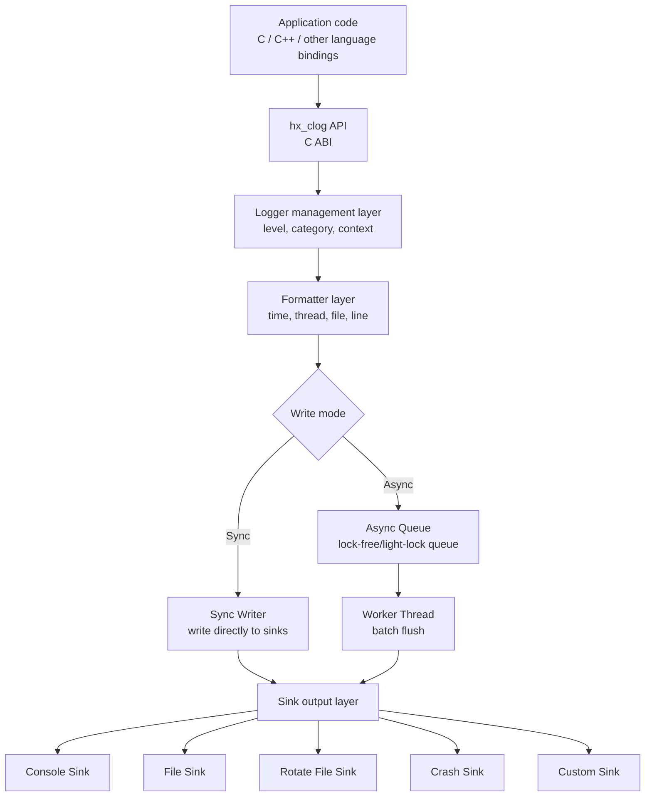

### 2.2 Core modules

| Module | Responsibility |
| --- | --- |
| `hx_clog.h` | Public C interface, macros, type definitions |
| `hx_clog_core.c` | logger lifecycle, global configuration, level filtering |
| `hx_clog_format.c` | Log formatting, time formatting, thread ID, source location |
| `hx_clog_sink.c` | Sink abstraction layer and unified output interface |
| `hx_clog_file.c` | File open, write, flush, fsync, path handling |
| `hx_clog_rotate.c` | Log rotation and history cleanup |
| `hx_clog_async.c` | Async queue, background thread, batched writes, shutdown drain |
| `hx_clog_crash.c` | Crash capture, recent-log protection, stack trace recording |
| `hx_clog_cpp.hpp` | Optional C++11 RAII wrapper; internally still calls the C API |

## 3. Recommended directory layout

```text
hx_clog/
├── CMakeLists.txt
├── include/
│   ├── hx_clog.h
│   └── hx_clog_cpp.hpp        # optional
├── src/
│   ├── hx_clog_core.c
│   ├── hx_clog_format.c
│   ├── hx_clog_sink.c
│   ├── hx_clog_file.c
│   ├── hx_clog_rotate.c
│   ├── hx_clog_async.c
│   └── hx_clog_crash.c
├── cmake/
│   └── hx_clogConfig.cmake.in
├── examples/
│   ├── c_basic.c
│   ├── c_async.c
│   ├── c_rotate.c
│   └── cpp11_basic.cpp
├── tests/
│   ├── test_format.c
│   ├── test_rotate.c
│   ├── test_async.c
│   └── test_crash.c
└── docs/
    ├── api.md
    ├── design.md
    └── crash.md
```

## 4. Log levels

The library should provide six common levels and one level for disabling logs:

| Level | Typical use |
| --- | --- |
| `HX_CLOG_TRACE` | Very fine-grained debug information, such as function enter/exit |
| `HX_CLOG_DEBUG` | Development-time debug information |
| `HX_CLOG_INFO` | Key business flow, startup parameters, state changes |
| `HX_CLOG_WARN` | Recoverable exceptions, missing configuration, retries |
| `HX_CLOG_ERROR` | Operation failure, request failure, unavailable resource |
| `HX_CLOG_FATAL` | Severe error that may require process exit |
| `HX_CLOG_OFF` | Disable logging |

Level filtering should happen as early as possible:

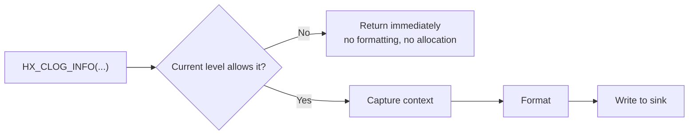

## 5. C API design

### 5.1 Basic types

```c
typedef enum hx_clog_level {
    HX_CLOG_LEVEL_TRACE = 0,
    HX_CLOG_LEVEL_DEBUG,
    HX_CLOG_LEVEL_INFO,
    HX_CLOG_LEVEL_WARN,
    HX_CLOG_LEVEL_ERROR,
    HX_CLOG_LEVEL_FATAL,
    HX_CLOG_LEVEL_OFF
} hx_clog_level_t;

typedef enum hx_clog_mode {
    HX_CLOG_MODE_SYNC = 0,
    HX_CLOG_MODE_ASYNC
} hx_clog_mode_t;

typedef enum hx_clog_rotate_policy {
    HX_CLOG_ROTATE_NONE = 0,
    HX_CLOG_ROTATE_BY_SIZE,
    HX_CLOG_ROTATE_BY_TIME,
    HX_CLOG_ROTATE_BY_SIZE_AND_TIME
} hx_clog_rotate_policy_t;
```

### 5.2 Configuration structure

```c
typedef struct hx_clog_config {
    const char* logger_name;       /* default "hx_clog" */
    const char* log_dir;           /* default "./logs" */
    const char* file_name;         /* default "app.log" */
    hx_clog_level_t level;         /* default INFO */
    hx_clog_mode_t mode;           /* default SYNC */

    int enable_console;            /* default 1 */
    int enable_file;               /* default 1 */
    int enable_color;              /* default 1, console only */
    int enable_crash_handler;      /* default 0, explicitly enabled */

    hx_clog_rotate_policy_t rotate_policy;
    unsigned long long max_file_size;  /* for example 10 * 1024 * 1024 */
    int max_backup_files;              /* for example 10 */
    int rotate_daily;                  /* whether to split by day */

    unsigned int async_queue_size;     /* default 8192 */
    unsigned int async_batch_size;     /* default 64 */
    unsigned int flush_interval_ms;    /* default 1000 */

    const char* pattern;               /* built-in default format */
} hx_clog_config_t;
```

> **About directories and file names**
>
> - `log_dir` supports multi-level relative or absolute paths (for example `"test/logs"` and `"./var/log/app"`).
>   `hx_clog_init()` will **recursively create** all missing intermediate directories (`/` and `\`
>   are both recognized; existing directories are skipped).
> - `file_name` should be a **plain file name** (for example `"app.log"`). Do not put
>   subdirectories into `file_name`. Put subdirectories in `log_dir` instead:
>   ```c
>   cfg.log_dir   = "test/logs";   /* recursively creates test and test/logs */
>   cfg.file_name = "xxx.log";
>   ```

### 5.3 Lifecycle APIs

```c
int hx_clog_init(const hx_clog_config_t* config);
void hx_clog_shutdown(void);
void hx_clog_flush(void);

void hx_clog_set_level(hx_clog_level_t level);
hx_clog_level_t hx_clog_get_level(void);

int hx_clog_reopen(void);  /* reopen after logrotate or external file move */
```

### 5.4 Write APIs

```c
void hx_clog_write(
    hx_clog_level_t level,
    const char* file,
    int line,
    const char* func,
    const char* fmt,
    ...
);

void hx_clog_writev(
    hx_clog_level_t level,
    const char* file,
    int line,
    const char* func,
    const char* fmt,
    va_list args
);
```

### 5.5 Recommended macros

```c
#define HX_LOG_TRACE(fmt, ...) \
    hx_clog_write(HX_CLOG_LEVEL_TRACE, __FILE__, __LINE__, __func__, fmt, ##__VA_ARGS__)

#define HX_LOG_DEBUG(fmt, ...) \
    hx_clog_write(HX_CLOG_LEVEL_DEBUG, __FILE__, __LINE__, __func__, fmt, ##__VA_ARGS__)

#define HX_LOG_INFO(fmt, ...) \
    hx_clog_write(HX_CLOG_LEVEL_INFO, __FILE__, __LINE__, __func__, fmt, ##__VA_ARGS__)

#define HX_LOG_WARN(fmt, ...) \
    hx_clog_write(HX_CLOG_LEVEL_WARN, __FILE__, __LINE__, __func__, fmt, ##__VA_ARGS__)

#define HX_LOG_ERROR(fmt, ...) \
    hx_clog_write(HX_CLOG_LEVEL_ERROR, __FILE__, __LINE__, __func__, fmt, ##__VA_ARGS__)

#define HX_LOG_FATAL(fmt, ...) \
    hx_clog_write(HX_CLOG_LEVEL_FATAL, __FILE__, __LINE__, __func__, fmt, ##__VA_ARGS__)
```

> Older Windows MSVC versions have inconsistent support for `##__VA_ARGS__`. In that case, provide extra helpers such as `HX_LOG_INFO0("message")` or use a C99/C++20-compatible macro strategy.

## 6. C usage examples

### 6.1 Minimal integration

```c
#include "hx_clog.h"

int main(void) {
    hx_clog_config_t config;
    hx_clog_config_default(&config);

    config.log_dir = "./logs";
    config.file_name = "demo.log";
    config.level = HX_CLOG_LEVEL_INFO;

    if (hx_clog_init(&config) != 0) {
        return 1;
    }

    HX_LOG_INFO("program started, pid=%d", 1234);
    HX_LOG_WARN("config value missing, use default");
    HX_LOG_ERROR("open file failed: %s", "data.txt");

    hx_clog_shutdown();
    return 0;
}
```

### 6.2 Async logging

```c
hx_clog_config_t config;
hx_clog_config_default(&config);

config.mode = HX_CLOG_MODE_ASYNC;
config.async_queue_size = 65536;
config.async_batch_size = 128;
config.flush_interval_ms = 500;

hx_clog_init(&config);
HX_LOG_INFO("async logging enabled");
hx_clog_shutdown(); /* drain the queue during shutdown */
```

### 6.3 Log rotation

```c
hx_clog_config_t config;
hx_clog_config_default(&config);

config.rotate_policy = HX_CLOG_ROTATE_BY_SIZE_AND_TIME;
config.max_file_size = 20ULL * 1024ULL * 1024ULL;
config.max_backup_files = 30;
config.rotate_daily = 1;

hx_clog_init(&config);
```

## 7. Optional C++11 wrapper

The C++11 wrapper should only improve usability; it should not reimplement core logic.

### 7.1 RAII management

```cpp
#include "hx_clog_cpp.hpp"

int main() {
    hx::clog::Config config;
    config.log_dir = "./logs";
    config.file_name = "cpp_demo.log";
    config.level = HX_CLOG_LEVEL_DEBUG;

    hx::clog::Logger logger(config);

    HX_LOG_INFO("C macro still works");
    logger.info("C++ wrapper message: {}", "hello"); // optional fmt style
}
```

### 7.2 C++ wrapper boundaries

| Item | Recommendation |
| --- | --- |
| Lifecycle | Use RAII to call `init/shutdown` automatically |
| Strings | Accept `std::string` and convert internally to `const char*` |
| Formatting | Optionally integrate `{fmt}`; when disabled, still use C `printf` style |
| Exceptions | Do not throw by default; use error codes, with optional macro-enabled exceptions |
| ABI | Do not export a C++ ABI; keep the core library C ABI stable |

## 8. Log format

### 8.1 Default format

```text
2026-06-07 15:04:05.123 [INFO ] [tid:12345] main.c:28 main() - server started, port=8080
```

Field descriptions:

| Field | Example | Description |
| --- | --- | --- |
| Time | `2026-06-07 15:04:05.123` | Local time with millisecond precision |
| Level | `[INFO ]` | Fixed width for alignment |
| Thread | `[tid:12345]` | Helps diagnose multi-threaded issues |
| Source | `main.c:28 main()` | File, line number, function name |
| Message | `server started` | User log content |

### 8.2 Pattern syntax

Suggested placeholders:

| Placeholder | Meaning |
| --- | --- |
| `%Y-%m-%d %H:%M:%S.%e` | Date and time, milliseconds |
| `%l` | Log level |
| `%t` | Thread ID |
| `%p` | Process ID |
| `%s` | Source file name (basename only) |
| `%F` | Full source file path (raw `__FILE__`) |
| `%#` | Line number |
| `%!` | Function name |
| `%v` | Log message |
| `%n` | Newline |
| `%%` | Literal percent sign |

Example:

```text
[%Y-%m-%d %H:%M:%S.%e] [%l] [pid:%p tid:%t] [%s:%#] %v%n
```

## 9. Sync logging design

Sync logging is the simplest and most reliable mode:

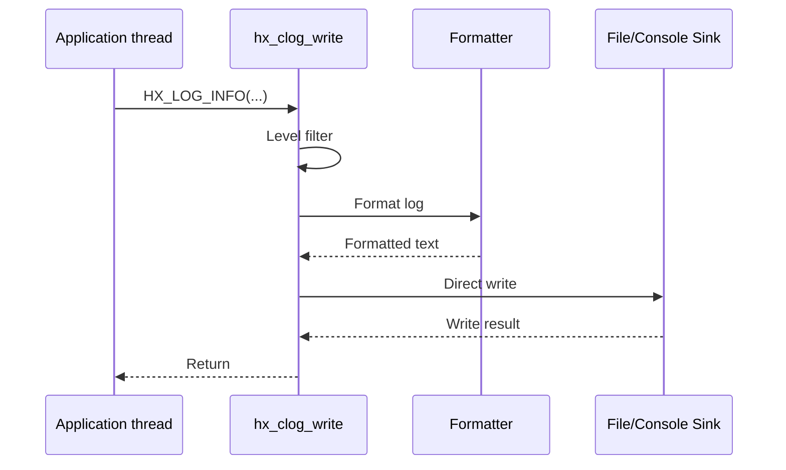

Advantages:

- Simple implementation and predictable behavior.
- The last log before a crash is more likely to reach disk.
- Suitable for CLI tools, test programs, and small embedded programs.

Disadvantages:

- File I/O can block business threads.
- Throughput is lower in high-frequency logging scenarios.

## 10. Async logging design

Async logging reduces caller latency through a queue and background thread:

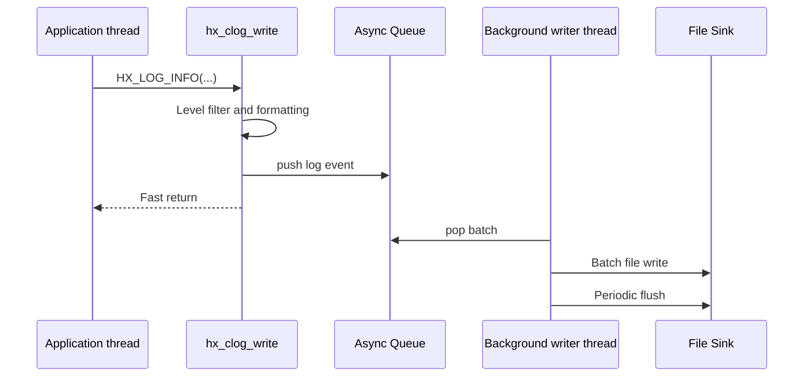

### 10.1 Queue strategies

When the async queue is full, support three strategies:

| Strategy | Behavior | Suitable scenario |
| --- | --- | --- |
| `BLOCK` | Block the business thread until space is available | Services that must not lose logs |
| `DROP_NEW` | Drop the current new log | Low-latency systems |
| `DROP_OLD` | Drop the oldest log and preserve the latest state | UI and real-time systems |

Recommended default: `BLOCK`, with stats counters:

```c
typedef struct hx_clog_stats {
    unsigned long long written_lines;
    unsigned long long dropped_lines;
    unsigned long long rotated_files;
    unsigned long long queue_high_watermark;
} hx_clog_stats_t;

int hx_clog_get_stats(hx_clog_stats_t* stats);
```

### 10.2 Async shutdown

`hx_clog_shutdown()` must perform a complete shutdown sequence:

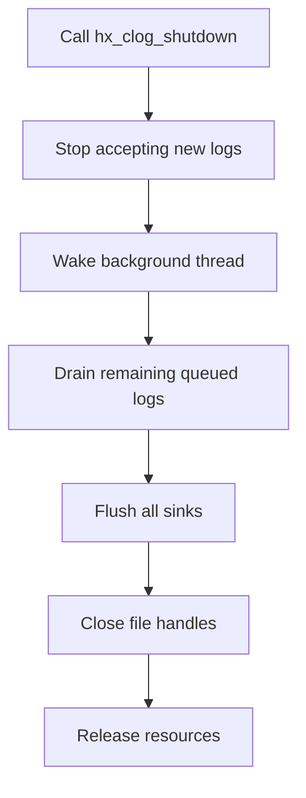

## 11. Log rotation

### 11.1 Rotation strategies

Log rotation prevents a single log file from growing forever.

| Strategy | Example | Description |
| --- | --- | --- |
| By size | `app.log` exceeds 20 MB | Most common, simple and reliable |
| By time | Generate `app.2026-06-07.log` every day | Convenient date-based archiving |
| Size + time | Split each daily file again by size | Recommended for services |
| Startup rotation | Move old logs on every start | Suitable for client tools |

### 11.2 File naming

Recommended format:

```text
logs/
├── app.log
├── app.2026-06-07.1.log
├── app.2026-06-07.2.log
├── app.2026-06-06.1.log
└── app.2026-06-05.1.log
```

Compressed archives may also be used:

```text
app.2026-06-06.1.log.gz
```

Compression should run in a background thread or separate maintenance thread to avoid blocking log writes.

### 11.3 Rotation flow

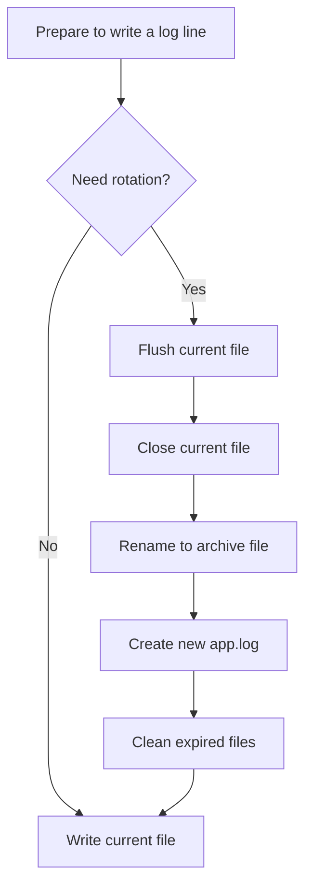

### 11.4 Cleanup rules

Support all of the following:

- Keep the most recent N files: `max_backup_files = 30`
- Keep the most recent N days: `max_backup_days = 7`
- Total log directory size limit: `max_total_size = 1GB`

Recommended cleanup order:

1. Delete files older than the day limit first.
2. Then delete the oldest files by file count.
3. Finally delete the oldest files by total directory size.

## 12. Crash logging

Crash handling is an important enhancement for a logging library, but it must be conservative. After a crash, the process state may already be corrupted, so the heap, locks, and stdio cannot be assumed safe.

### 12.1 Supported targets

| Platform | Capability |
| --- | --- |
| Windows | Capture SEH exceptions, generate crash logs, optional MiniDump |
| Linux | Capture `SIGSEGV`, `SIGABRT`, `SIGFPE`, `SIGILL`, `SIGBUS` |
| macOS | Capture common POSIX signals, reserve Mach exception extension points |
| Android | Capture signals, optionally integrate tombstone / logcat |

### 12.2 Crash module responsibilities

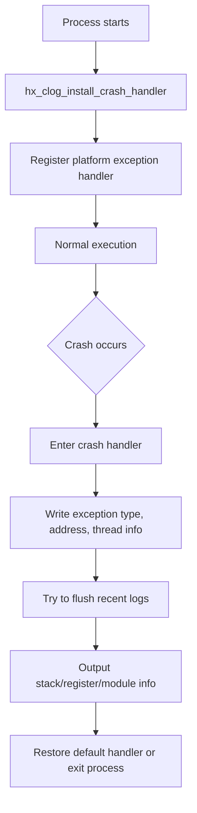

### 12.3 Precise crash location and stack traces

The `hx_clog` crash log should not merely say "the program crashed"; it should also try to say "where it crashed". Ideal output includes:

- Crash type, such as `SIGSEGV`, `SIGABRT`, or Windows SEH `EXCEPTION_ACCESS_VIOLATION`.
- Crash address: the instruction pointer where the CPU was executing, such as `RIP/EIP` on x86/x64.
- Access address: for example `fault address = 0x00000000` for a null pointer access.
- Crashing thread: thread ID and thread name.
- Precise source location: function name, source file, line number.
- Stack trace: call chain from the crash site upward.
- Module information: executable or dynamic library name, module base address, offset address.
- Recent logs: last N business logs before the crash.

#### 12.3.1 Crash log output example

```text
========== hx_clog crash report ==========
time: 2026-06-07 20:45:31.128
process: demo_server
pid: 8342
thread: 12984 (worker-3)

exception:
  type: SIGSEGV
  signal: 11
  reason: address not mapped
  fault_address: 0x0000000000000008
  instruction_pointer: 0x00000001400125af

crash_location:
  module: demo_server
  function: handle_request
  file: D:/project/src/server.c
  line: 218

stacktrace:
  #00 0x00000001400125af demo_server!handle_request
      D:/project/src/server.c:218
  #01 0x0000000140011d34 demo_server!worker_loop
      D:/project/src/worker.c:94
  #02 0x000000014000f820 demo_server!thread_entry
      D:/project/src/thread.c:37
  #03 0x00007ffb11247374 KERNEL32!BaseThreadInitThunk
  #04 0x00007ffb12a1cc91 ntdll!RtlUserThreadStart

last_logs:
  2026-06-07 20:45:30.991 [INFO ] [tid:12984] request id=10021 started
  2026-06-07 20:45:31.003 [DEBUG] [tid:12984] user_id=42, body_size=168
  2026-06-07 20:45:31.127 [WARN ] [tid:12984] request context missing optional field
==========================================
```

> Precise source file and line numbers require debug symbols. Windows needs PDBs; Linux/macOS/Android usually need DWARF debug information. Without symbols, the report should at least output module name, address, and offset so symbol tools can restore the source location later.

#### 12.3.2 Stack trace capture flow

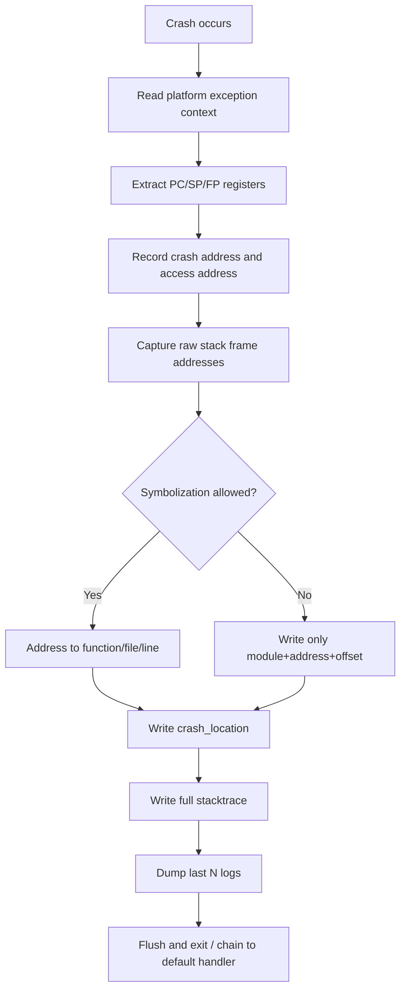

#### 12.3.3 Platform implementation suggestions

| Platform | Capture method | Symbolization method |
| --- | --- | --- |
| Windows | `SetUnhandledExceptionFilter`, Vectored Exception Handler, `CaptureStackBackTrace`, `StackWalk64` | `SymInitialize`, `SymFromAddr`, `SymGetLineFromAddr64`, with PDB |
| Linux | `sigaction + SA_SIGINFO` to get `ucontext_t`, `backtrace` or `libunwind` for unwinding | `dladdr` for module and symbol, `addr2line` / `llvm-symbolizer` for DWARF file and line |
| macOS | `sigaction + ucontext_t`, `backtrace` or `_Unwind_Backtrace` | `dladdr`, `atos`, dSYM |
| Android | `sigaction + ucontext_t`, NDK unwinder / `libunwindstack` | tombstone, `ndk-stack`, `llvm-symbolizer` |

Recommended implementation split:

1. **Only collect raw information inside the crash handler**: exception type, registers, PC, SP, FP, module address, stack frame addresses.
2. **Defer symbolization when possible**: prefer writing raw addresses first, then convert them to file and line through a helper thread, child process, external tool, or on next startup.

This balances crash-path safety with complete diagnostic information.

#### 12.3.4 Compile options required for precise locations

To let crash logs output accurate functions, files, and line numbers, keep debug symbols in Debug, RelWithDebInfo, and production diagnostic builds.

| Compiler | Recommended options |
| --- | --- |
| MSVC | `/Zi` or `/Z7`, generate PDB at link time; Release may use `/DEBUG` |
| GCC / Clang | `-g -fno-omit-frame-pointer` |
| MinGW | `-g -fno-omit-frame-pointer` |
| Android NDK | `-g -fno-omit-frame-pointer`, keep unstripped `.so` files for symbolization |
| macOS / iOS | `-g`, generate and keep dSYM |

CMake can provide diagnostic options:

```cmake
option(HX_CLOG_ENABLE_STACKTRACE "Enable crash stacktrace capture" ON)
option(HX_CLOG_ENABLE_SYMBOLIZE "Enable address symbolization" ON)
option(HX_CLOG_KEEP_FRAME_POINTER "Keep frame pointer for better stacktrace" ON)

if(HX_CLOG_KEEP_FRAME_POINTER AND (CMAKE_C_COMPILER_ID MATCHES "GNU|Clang"))
    target_compile_options(hx_clog PUBLIC -fno-omit-frame-pointer)
endif()

if(MSVC)
    target_compile_options(hx_clog PUBLIC /Zi)
    target_link_options(hx_clog PUBLIC /DEBUG)
endif()
```

#### 12.3.5 Mapping addresses to source lines

When the crash handler can only safely write addresses, the log should still preserve enough information for offline restoration:

```text
#00 module=demo_server base=0x0000000140000000 pc=0x00000001400125af offset=0x125af
```

Offline tools:

```bash
addr2line -e demo_server -f -C 0x125af
llvm-symbolizer -e demo_server 0x125af
```

On Windows, PDB and `dbghelp` can be used for online resolution; Visual Studio, WinDbg, or a symbol server can be used offline.

### 12.4 Crash API

```c
typedef struct hx_clog_crash_config {
    const char* crash_dir;
    int dump_fault_location;
    int dump_stacktrace;
    int dump_registers;
    int symbolize_stacktrace;
    int stacktrace_max_depth;
    const char* symbol_search_path;
    int create_minidump;       /* available on Windows */
    int chain_previous_handler;
} hx_clog_crash_config_t;

int hx_clog_install_crash_handler(const hx_clog_crash_config_t* config);
void hx_clog_uninstall_crash_handler(void);
```

Suggested fields:

| Field | Description |
| --- | --- |
| `dump_fault_location` | Output crash-site PC, access address, module offset, source location |
| `dump_stacktrace` | Output call stack |
| `dump_registers` | Output registers for low-level analysis |
| `symbolize_stacktrace` | Try to resolve addresses into function names, files, and line numbers |
| `stacktrace_max_depth` | Maximum stack depth, such as 64 or 128 |
| `symbol_search_path` | Search path for PDB, dSYM, or unstripped `.so` files |
| `create_minidump` | Generate a `.dmp` file on Windows |
| `chain_previous_handler` | Whether to call the previous handler after processing |

### 12.5 Last-log buffer

To show what happened just before a crash, maintain a fixed-size in-memory ring buffer:

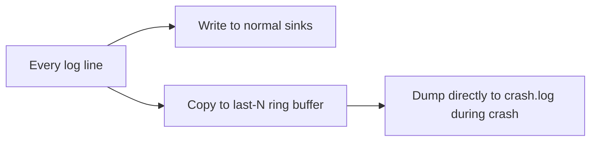

Recommended rules:

- Buffer the most recent 256 to 4096 log lines.
- Use preallocated memory to avoid `malloc` in the crash handler.
- In the crash handler, only do low-level writes that are as safe as possible.
- If a lock is unavailable, skip some information rather than deadlocking.

### 12.6 Signal-safety recommendations

POSIX signal handlers may only call async-signal-safe functions. Do not call complex formatting, `malloc`, `printf`, or `pthread_mutex_lock` in a signal handler.

Recommended approach:

1. Pre-format and store the last N log lines during normal execution.
2. During crash handling, use `write()` to output existing bytes.
3. If a full stack trace is required, fork a child process or preload an unwinder before the crash, but this increases implementation complexity.

### 12.7 Windows MiniDump

Windows can optionally support `MiniDumpWriteDump`:

```text
crash/
├── crash_20260607_150405.log
└── crash_20260607_150405.dmp
```

Suggested CMake option:

```cmake
option(HX_CLOG_ENABLE_MINIDUMP "Enable Windows minidump support" ON)
```

## 13. Sink output layer

A sink is a log output target. Every log line is eventually written to one or more sinks.

```c
typedef struct hx_clog_sink hx_clog_sink_t;

typedef struct hx_clog_sink_vtable {
    int  (*write)(hx_clog_sink_t* sink, const char* data, unsigned int size);
    int  (*flush)(hx_clog_sink_t* sink);
    void (*close)(hx_clog_sink_t* sink);
} hx_clog_sink_vtable_t;
```

### 13.1 Built-in sinks

| sink | Description |
| --- | --- |
| Console Sink | Output to stdout/stderr, colored by level |
| File Sink | Output to a fixed file |
| Rotate File Sink | Automatically rotate files |
| Crash Sink | Dedicated crash information output |
| Callback Sink | User-defined handling, such as GUI, network, or database output |
| Syslog Sink | Linux/macOS system log, optional |
| EventLog Sink | Windows Event Log, optional |
| Android Log Sink | Android logcat, optional |

### 13.2 Custom sink

```c
typedef int (*hx_clog_callback_t)(
    hx_clog_level_t level,
    const char* data,
    unsigned int size,
    void* user_data
);

int hx_clog_add_callback_sink(hx_clog_callback_t cb, void* user_data);
```

## 14. Thread safety

`hx_clog` should guarantee the following thread-safety properties:

| Interface | Thread-safety requirement |
| --- | --- |
| `hx_clog_write` | Must be thread-safe |
| `hx_clog_flush` | Must be thread-safe |
| `hx_clog_set_level` | Use atomic variables |
| `hx_clog_shutdown` | Only one real shutdown; repeated calls should return safely |
| sink writes | Internal locking is required in sync mode |

Recommendations:

- Use atomic reads/writes for log level to reduce hot-path overhead.
- Use a lightweight mutex for synchronous file writes.
- In async mode, business threads only push into the queue.
- During shutdown, set a state flag to avoid crashes from writes after shutdown.

## 15. Memory management

Common logging-library problems include excessive allocation and unstable exceptional paths. Recommended strategies:

| Scenario | Strategy |
| --- | --- |
| Short logs | Use a fixed stack buffer, such as 1 KB or 2 KB |
| Long logs | Allocate dynamically only after exceeding the stack buffer |
| Async queue | Preallocate message slots during initialization |
| Crash ring buffer | Allocate fixed memory during initialization and never allocate during crash |
| Custom allocator | Allow users to plug in a memory pool |

Optional allocator API:

```c
typedef void* (*hx_clog_malloc_fn)(unsigned int size, void* user_data);
typedef void  (*hx_clog_free_fn)(void* ptr, void* user_data);

typedef struct hx_clog_allocator {
    hx_clog_malloc_fn malloc_fn;
    hx_clog_free_fn free_fn;
    void* user_data;
} hx_clog_allocator_t;

int hx_clog_set_allocator(const hx_clog_allocator_t* allocator);
```

### 15.1 Single-line log size limit

Single-line log size handling is **exactly the same in sync and async mode**:

| Stage | Behavior |
| --- | --- |
| Short log | First writes into a 1 KB stack buffer, zero heap allocation |
| Long log | Dynamically allocates after exceeding the stack buffer, with a **default limit of 512 KB** |
| Async queue | Each queue slot buffer grows on demand and is reused, so it can hold a complete large line instead of truncating to a fixed slot size |

> Earlier implementations limited async mode by a fixed slot size (about 512 bytes per line). This has been changed to a grow-on-demand reusable buffer, so **both sync and async can output a single log line up to 512 KB**, while regular-size logs still require no extra allocation in the steady state.

**Removing the limit (memory-bound only)**: enable the CMake option `HX_CLOG_UNLIMITED_LINE`, and single log lines no longer have a fixed size limit; they can grow up to the maximum memory the process can allocate:

```bash
cmake -S . -B build -DHX_CLOG_UNLIMITED_LINE=ON
```

You can also use `-DHX_CLOG_MAX_LINE_BYTES=<bytes>` to customize a specific cap, for example `-DHX_CLOG_MAX_LINE_BYTES=2097152` for 2 MB. This value is ignored when `HX_CLOG_UNLIMITED_LINE` is enabled.

> Note: the "last N logs" ring buffer in crash reports still uses a fixed 512-byte entry size. The crash path needs preallocated memory and must not allocate during a crash. This only affects replay length in the crash report and does not affect normal console/file output.

## 16. Cross-platform CMake build

### 16.0 Source encoding and MSVC UTF-8 option

All source files, headers, and documents in this project use **UTF-8 without BOM**.

MSVC defaults to parsing source files with the system codepage, such as GBK/936 on Simplified Chinese systems. Non-ASCII characters in UTF-8 source files may trigger warning `C4819` or even corrupt string literals. To avoid this, CMake explicitly enables `/utf-8` for MSVC, setting both source and execution character sets to UTF-8. This makes compilation independent of system locale:

```cmake
if(MSVC)
    add_compile_options(/utf-8)
endif()
```

This option is placed after the top-level `project()` and before defining any target, so it applies to the library, examples, and tests. GCC/Clang already treat source files as UTF-8 by default and need no extra option.

> Convention: keep committed files as UTF-8 without BOM. Do not let editors write a BOM or save as UTF-16/GBK, otherwise cross-platform builds may produce warnings or mojibake.

### 16.1 CMake target

Export a standard CMake target:

```cmake
find_package(hx_clog CONFIG REQUIRED)
target_link_libraries(my_app PRIVATE hx_clog::hx_clog)
```

### 16.2 Top-level CMakeLists.txt example

```cmake
cmake_minimum_required(VERSION 3.16)

project(hx_clog
    VERSION 1.0.0
    DESCRIPTION "A portable C/C++11 logging framework"
    LANGUAGES C CXX
)

option(HX_CLOG_BUILD_SHARED "Build hx_clog as shared library" OFF)
option(HX_CLOG_BUILD_EXAMPLES "Build examples" ON)
option(HX_CLOG_BUILD_TESTS "Build tests" ON)
option(HX_CLOG_ENABLE_CPP11 "Enable C++11 wrapper" ON)
option(HX_CLOG_ENABLE_ASYNC "Enable async logging" ON)
option(HX_CLOG_ENABLE_CRASH "Enable crash handler" ON)
option(HX_CLOG_ENABLE_COLOR "Enable colored console output" ON)
option(HX_CLOG_ENABLE_SYSLOG "Enable syslog sink on Unix" OFF)
option(HX_CLOG_ENABLE_MINIDUMP "Enable minidump on Windows" ON)

set(HX_CLOG_SOURCES
    src/hx_clog_core.c
    src/hx_clog_format.c
    src/hx_clog_sink.c
    src/hx_clog_file.c
    src/hx_clog_rotate.c
)

if(HX_CLOG_ENABLE_ASYNC)
    list(APPEND HX_CLOG_SOURCES src/hx_clog_async.c)
endif()

if(HX_CLOG_ENABLE_CRASH)
    list(APPEND HX_CLOG_SOURCES src/hx_clog_crash.c)
endif()

if(HX_CLOG_BUILD_SHARED)
    add_library(hx_clog SHARED ${HX_CLOG_SOURCES})
else()
    add_library(hx_clog STATIC ${HX_CLOG_SOURCES})
endif()

add_library(hx_clog::hx_clog ALIAS hx_clog)

target_include_directories(hx_clog
    PUBLIC
        $<BUILD_INTERFACE:${CMAKE_CURRENT_SOURCE_DIR}/include>
        $<INSTALL_INTERFACE:include>
)

target_compile_features(hx_clog PUBLIC c_std_99)

if(HX_CLOG_ENABLE_CPP11)
    target_compile_features(hx_clog PUBLIC cxx_std_11)
    target_compile_definitions(hx_clog PUBLIC HX_CLOG_ENABLE_CPP11=1)
endif()

if(HX_CLOG_ENABLE_ASYNC)
    target_compile_definitions(hx_clog PUBLIC HX_CLOG_ENABLE_ASYNC=1)
endif()

if(HX_CLOG_ENABLE_CRASH)
    target_compile_definitions(hx_clog PUBLIC HX_CLOG_ENABLE_CRASH=1)
endif()

if(WIN32)
    target_compile_definitions(hx_clog PRIVATE HX_CLOG_PLATFORM_WINDOWS=1)
    target_link_libraries(hx_clog PRIVATE dbghelp)
elseif(APPLE)
    target_compile_definitions(hx_clog PRIVATE HX_CLOG_PLATFORM_APPLE=1)
    target_link_libraries(hx_clog PRIVATE pthread)
elseif(UNIX)
    target_compile_definitions(hx_clog PRIVATE HX_CLOG_PLATFORM_UNIX=1)
    target_link_libraries(hx_clog PRIVATE pthread)
endif()

include(GNUInstallDirs)

install(TARGETS hx_clog
    EXPORT hx_clogTargets
    ARCHIVE DESTINATION ${CMAKE_INSTALL_LIBDIR}
    LIBRARY DESTINATION ${CMAKE_INSTALL_LIBDIR}
    RUNTIME DESTINATION ${CMAKE_INSTALL_BINDIR}
)

install(DIRECTORY include/ DESTINATION ${CMAKE_INSTALL_INCLUDEDIR})

install(EXPORT hx_clogTargets
    FILE hx_clogTargets.cmake
    NAMESPACE hx_clog::
    DESTINATION ${CMAKE_INSTALL_LIBDIR}/cmake/hx_clog
)
```

### 16.3 Common build commands

#### Windows MSVC

```powershell
cmake -S . -B build -G "Visual Studio 17 2022" -A x64
cmake --build build --config Release
cmake --install build --config Release --prefix install
```

#### Windows MinGW

```powershell
cmake -S . -B build -G "MinGW Makefiles" -DCMAKE_BUILD_TYPE=Release
cmake --build build
```

#### Linux

```bash
cmake -S . -B build -DCMAKE_BUILD_TYPE=Release
cmake --build build -j
sudo cmake --install build
```

#### macOS

```bash
cmake -S . -B build -DCMAKE_BUILD_TYPE=Release
cmake --build build -j
cmake --install build --prefix ./install
```

#### Android NDK

```bash
cmake -S . -B build-android \
  -DCMAKE_TOOLCHAIN_FILE=$ANDROID_NDK/build/cmake/android.toolchain.cmake \
  -DANDROID_ABI=arm64-v8a \
  -DANDROID_PLATFORM=android-23 \
  -DCMAKE_BUILD_TYPE=Release

cmake --build build-android -j
```

#### iOS

iOS usually requires an external toolchain file, such as `ios-cmake`:

```bash
cmake -S . -B build-ios \
  -DCMAKE_TOOLCHAIN_FILE=ios.toolchain.cmake \
  -DPLATFORM=OS64 \
  -DCMAKE_BUILD_TYPE=Release

cmake --build build-ios -j
```

## 17. Export symbols and ABI

To support shared libraries, define a unified export macro:

```c
#if defined(_WIN32)
#  if defined(HX_CLOG_BUILD_SHARED)
#    if defined(HX_CLOG_EXPORTS)
#      define HX_CLOG_API __declspec(dllexport)
#    else
#      define HX_CLOG_API __declspec(dllimport)
#    endif
#  else
#    define HX_CLOG_API
#  endif
#else
#  if defined(HX_CLOG_BUILD_SHARED)
#    define HX_CLOG_API __attribute__((visibility("default")))
#  else
#    define HX_CLOG_API
#  endif
#endif
```

ABI stability recommendations:

- Expose only C functions publicly.
- Add a `size` field or version field to structs to support future compatible extension.
- Do not expose C++ types in the ABI.
- Do not require callers and the library to use the same C++ STL.

## 18. Error code design

```c
typedef enum hx_clog_result {
    HX_CLOG_OK = 0,
    HX_CLOG_ERR_INVALID_ARGUMENT = -1,
    HX_CLOG_ERR_NOT_INITIALIZED = -2,
    HX_CLOG_ERR_ALREADY_INITIALIZED = -3,
    HX_CLOG_ERR_OPEN_FILE_FAILED = -4,
    HX_CLOG_ERR_OUT_OF_MEMORY = -5,
    HX_CLOG_ERR_THREAD_FAILED = -6,
    HX_CLOG_ERR_QUEUE_FULL = -7,
    HX_CLOG_ERR_PLATFORM = -8
} hx_clog_result_t;
```

Provide:

```c
const char* hx_clog_strerror(int err);
```

## 19. Configuration file support

The base library does not necessarily need to read configuration files, but an optional extension can be provided.

### 19.1 INI example

```ini
[hx_clog]
level=info
mode=async
log_dir=./logs
file_name=app.log
enable_console=true
enable_file=true
rotate_policy=size_and_time
max_file_size=20971520
max_backup_files=30
flush_interval_ms=500
```

### 19.2 Environment variables

Recommended environment-variable overrides:

| Variable | Description |
| --- | --- |
| `HX_CLOG_LEVEL` | Override log level |
| `HX_CLOG_DIR` | Override log directory |
| `HX_CLOG_MODE` | `sync` or `async` |
| `HX_CLOG_CONSOLE` | Whether console output is enabled |

## 20. Performance design

### 20.1 Hot-path optimization

The logging hot path should be as short as possible:

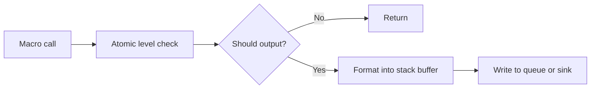

Recommended optimizations:

- Perform level filtering before formatting.
- Use a stack buffer for common logs to avoid heap allocation.
- Batch writes in async mode to reduce system calls.
- Use buffered I/O or platform-native batched writes for file output.
- Optionally disable source file, function name, and similar fields to reduce overhead.

### 20.2 Benchmark metrics

Recommended measurements:

| Metric | Description |
| --- | --- |
| Single-thread sync throughput | Log lines written per second |
| Multi-thread sync throughput | Lock contention behavior across threads |
| Async enqueue latency | Average cost of `HX_LOG_INFO` |
| Total async throughput | Actual disk write speed of the background thread |
| Dropped log count | Whether queue-full behavior matches expectations |
| Crash flush success rate | Whether final logs survive during crashes |

## 21. Safety and reliability

| Issue | Design recommendation |
| --- | --- |
| Multiple threads initialize simultaneously | Protect with one-time initialization |
| Writes after shutdown | Return an error or write to fallback stderr |
| Disk full | Emit error counters and avoid infinite loops |
| File deleted externally | Periodically detect inode/handle state and support `hx_clog_reopen` |
| Queue full | Block or drop according to strategy and collect stats |
| Invalid state after fork | Provide `hx_clog_after_fork_child` on Unix |
| Crash handler deadlock | Avoid ordinary mutexes and malloc on the crash path |

## 22. Test plan

### 22.1 Unit tests

| Test | Focus |
| --- | --- |
| Formatting test | Time, level, thread, file, and line number are formatted correctly |
| Level filtering test | Low-level logs are not formatted or written |
| File write test | File creation, append, flush, close |
| Rotation test | Size rotation, time rotation, old-file cleanup |
| Async test | Queue, background thread, shutdown drain |
| Multi-thread test | Concurrent writes do not crash and do not produce unacceptable disorder |
| Crash test | Trigger crash and generate crash file |

### 22.2 Integration tests

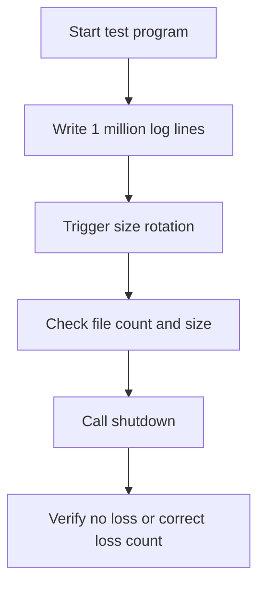

### 22.3 Suggested CI platforms

| Platform | Compiler |
| --- | --- |
| Windows | MSVC, MinGW |
| Linux | GCC, Clang |
| macOS | AppleClang |
| Android | NDK Clang |

## 23. Alignment with common logging libraries

| Capability | hx_clog recommendation | Description |
| --- | --- | --- |
| Multiple levels | Required | Basic logging-library capability |
| Colored console | Supported | Improves development experience |
| File logging | Required | Required in production |
| Rotating logs | Required | Aligns with mature logging libraries |
| Async logging | Supported | Core capability for high-frequency logging |
| Custom sink | Supported | Easy extension to GUI, network, database |
| Crash logs | Strongly recommended | More valuable for troubleshooting than ordinary logging alone |
| C ABI | Supported by default | Better for low-level libraries and cross-language use |
| C++11 wrapper | Optional | Improves ergonomics for C++ projects |
| Header-only | Not recommended by default | crash, async, and file modules are better as a compiled library |

## 24. Recommended default configuration

```c
void hx_clog_config_default(hx_clog_config_t* config) {
    memset(config, 0, sizeof(*config));
    config->logger_name = "hx_clog";
    config->log_dir = "./logs";
    config->file_name = "app.log";
    config->level = HX_CLOG_LEVEL_INFO;
    config->mode = HX_CLOG_MODE_SYNC;
    config->enable_console = 1;
    config->enable_file = 1;
    config->enable_color = 1;
    config->enable_crash_handler = 0;
    config->rotate_policy = HX_CLOG_ROTATE_BY_SIZE_AND_TIME;
    config->max_file_size = 10ULL * 1024ULL * 1024ULL;
    config->max_backup_files = 10;
    config->rotate_daily = 1;
    config->async_queue_size = 8192;
    config->async_batch_size = 64;
    config->flush_interval_ms = 1000;
    config->pattern = "%Y-%m-%d %H:%M:%S.%e [%l] [tid:%t] %s:%# %!() - %v%n";
}
```

## 25. Development roadmap

### Phase 1: Usable

- C API.
- Console output.
- Plain file output.
- Log-level filtering.
- Basic formatting.
- CMake static-library build.

### Phase 2: Pleasant to use

- Log rotation.
- Async logging.
- Colored console.
- Custom pattern.
- Multi-platform CI.
- Examples and tests.

### Phase 3: Reliable

- crash handler.
- last-N log ring buffer.
- Windows MiniDump.
- Unix signal crash log.
- Exceptional-path handling such as disk full, external deletion, and reopen.

### Phase 4: Extensible

- Custom sink.
- syslog / EventLog / Android logcat.
- C++11 RAII wrapper.
- Configuration file loading.
- Performance benchmark.

## 26. Minimal shippable API list

For a small but complete first version, implement at least:

```c
void hx_clog_config_default(hx_clog_config_t* config);
int hx_clog_init(const hx_clog_config_t* config);
void hx_clog_shutdown(void);
void hx_clog_flush(void);
void hx_clog_set_level(hx_clog_level_t level);
hx_clog_level_t hx_clog_get_level(void);
void hx_clog_write(
    hx_clog_level_t level,
    const char* file,
    int line,
    const char* func,
    const char* fmt,
    ...
);
```

Macros:

```c
HX_LOG_TRACE(...)
HX_LOG_DEBUG(...)
HX_LOG_INFO(...)
HX_LOG_WARN(...)
HX_LOG_ERROR(...)
HX_LOG_FATAL(...)
```

This first version can satisfy most real project integration needs. Async, rotation, crash handling, and the C++11 wrapper can be added gradually afterward.

## 27. Recommended implementation priority


## 28. Summary

The core idea of `hx_clog` is:

- **Use the C API as the foundation**: stable, lightweight, cross-language.
- **Keep sync mode simple and reliable**: prioritize the first usable version.
- **Use async mode to solve performance pressure**: queue, background thread, batched flush.
- **Use rotation for production maintainability**: manage files by size, date, and retention rules.
- **Use crash support for critical troubleshooting**: preserve recent logs, exception information, and call stacks.
- **Use CMake as the cross-platform entry point**: Windows, Linux, macOS, Android, and iOS can all build through one system.

With this architecture, `hx_clog` can grow from a simple C logging library into a foundation component with capabilities close to mature commercial/open-source logging frameworks.
