# hx_clog

一个面向 **C / C++11** 项目的跨平台日志框架，核心接口保持 C ABI，适合嵌入式、服务端、客户端、工具程序、游戏和音视频等场景接入。默认推荐使用 C 接口；C++11 接口是轻量 RAII 封装层，不影响纯 C 项目使用。

[](https://github.com/HuangX666/hx_clog/actions/workflows/ci.yml)
[](CMakeLists.txt)
[](include/hx_clog.h)
[](include/hx_clog_cpp.hpp)
[](.github/workflows/ci.yml)
[](LICENSE)

## 项目概览

| 项目 | 说明 |
| --- | --- |
| 核心语言 | C99，公开 C ABI |
| 可选封装 | C++11 RAII wrapper |
| 构建系统 | CMake 3.16+ |
| 支持平台 | Windows、Linux、macOS；CI smoke build 覆盖 Android arm64-v8a / iOS arm64 |
| 输出目标 | Console、File、Rotate File、Syslog、Windows Event Log、Android logcat、Apple os_log、自定义 callback |
| 写入模式 | 同步 / 异步，支持阻塞、丢弃新日志、丢弃旧日志等队列溢出策略 |
| 格式化 | pattern、自定义 formatter、JSON 输出 |
| 可靠性 | 文件轮转、启动轮转、时间间隔轮转、崩溃日志、最后 N 条日志 ring buffer |
| 扩展点 | sink、formatter、allocator、命名 logger、线程本地 context |

## CI/CD 状态

当前 `master` 分支已接入 GitHub Actions，README 顶部的 CI 徽章会实时展示测试结果。

| Workflow | 覆盖范围 |
| --- | --- |
| `build-and-test` | Ubuntu / Windows / macOS，Debug / Release，全量构建 examples + tests |
| `ctest` | format、rotate、large line、features、rotate time、crash、async、C++11 wrapper |
| `packaging-smoke` | Linux Release 安装包 smoke test，验证导出的 CMake package 和 public headers |
| `mobile-smoke` | Android arm64-v8a 和 iOS arm64 交叉编译 smoke build |
| Linux syslog check | CI 中启用 `HX_CLOG_ENABLE_SYSLOG=ON` 编译 syslog sink 路径 |

## 功能亮点

| 能力 | 说明 |
| --- | --- |
| C 优先 | 公开 API 使用 C ABI，方便 C、C++、Rust、Go、Python FFI 或扩展层接入 |
| 跨平台 | Windows / Linux / macOS CI 全覆盖，平台相关 sink 通过条件编译启用 |
| 同步和异步 | 小工具可用同步模式，服务端可用异步队列降低业务线程 IO 阻塞 |
| 多 logger | 支持默认 logger、命名 logger、独立 logger level 和 `HX_LOG_NAMED_*` 宏 |
| 上下文日志 | 支持 thread-local context，pattern 中用 `%x` 输出，JSON 中自动携带 |
| 多格式输出 | 内置 pattern、JSON formatter，也可注册自定义 formatter |
| 多输出目标 | 控制台、文件、轮转文件、系统日志和自定义 callback sink |
| 文件轮转 | 支持按大小、按天、按时间间隔、启动时归档旧 active 文件，超出保留数量的旧备份可用 zlib 压缩为 `.gz` |
| 崩溃日志 | 支持 SEH / POSIX signal 捕获、调用栈、寄存器 dump、最后日志保护 |
| 运行时配置 | 支持运行时修改级别、pattern、formatter、format mode 和重建内置 sinks |

## 快速开始

```sh
cmake -S . -B build -DHX_CLOG_BUILD_EXAMPLES=ON -DHX_CLOG_BUILD_TESTS=ON
cmake --build build --config Debug --parallel
ctest --test-dir build -C Debug --output-on-failure
```

### C 最小示例

```c
#include "hx_clog.h"

int main(void) {
    hx_clog_config_t cfg;
    hx_clog_config_default(&cfg);

    cfg.log_dir = "./logs";
    cfg.file_name = "app.log";
    cfg.level = HX_CLOG_LEVEL_INFO;
    cfg.mode = HX_CLOG_MODE_ASYNC;

    if (hx_clog_init(&cfg) != HX_CLOG_OK) {
        return 1;
    }

    hx_clog_context_put("request_id", "42");
    HX_LOG_INFO("service started: port=%d", 8080);
    HX_LOG_NAMED_WARN("net", "retry connect to %s", "127.0.0.1");

    hx_clog_shutdown();
    return 0;
}
```

### C++11 最小示例

```cpp
#include "hx_clog_cpp.hpp"

int main() {
    hx::clog::Config config;
    config.dir("./logs")
          .file("cpp_demo.log")
          .level(HX_CLOG_LEVEL_DEBUG);

    hx::clog::Logger logger(config);
    if (!logger.ok()) {
        return 1;
    }

    logger.context("module", "demo");
    logger.infof("hello {}, value={}", "hx_clog", 7);
    return 0;
}
```

## 文档导航

| 文档 | 内容 |
| --- | --- |
| [docs/api.md](docs/api.md) | API、logger、formatter、sink、轮转、环境变量 |
| [docs/design.md](docs/design.md) | 模块划分、写入路径、线程模型、内存策略 |
| [docs/crash.md](docs/crash.md) | Crash handler、minidump、stacktrace、last-N logs |
| [docs/ci.md](docs/ci.md) | GitHub Actions、平台矩阵、本地验证命令 |

---

下面保留完整的详细设计说明，方便继续查看架构、API 和实现细节。

## 1. 项目定位

`hx_clog` 是一个面向 C / C++11 项目的跨平台日志框架，目标是在嵌入式、服务端、客户端、工具程序和游戏/音视频等场景中提供统一、可靠、易接入的日志能力。

它应该具备以下特点：

| 能力 | 说明 |
| --- | --- |
| C 优先 | 核心接口使用 C ABI，方便被 C、C++、Rust、Go、Python 扩展层调用 |
| 跨平台 | 支持 Windows、Linux、macOS，预留 Android、iOS、嵌入式适配点 |
| 同步日志 | 调用线程直接写日志，简单可靠，适合小工具和调试阶段 |
| 异步日志 | 后台线程批量写入，降低业务线程 IO 阻塞 |
| 日志轮转 | 支持按文件大小、日期、启动次数进行轮转 |
| 多输出目标 | 控制台、普通文件、滚动文件、系统日志、自定义回调 |
| 崩溃日志 | 捕获 crash 信息，尽量输出最后日志、调用栈、信号/异常信息 |
| 可配置 | 支持运行时配置日志级别、格式、输出目标、队列大小等 |
| 低侵入 | 一个头文件即可使用基础能力，CMake 可选择静态库/动态库 |
| 可扩展 | sink、formatter、allocator、clock、thread 等模块可替换 |

## 2. 总体架构

### 2.1 分层设计

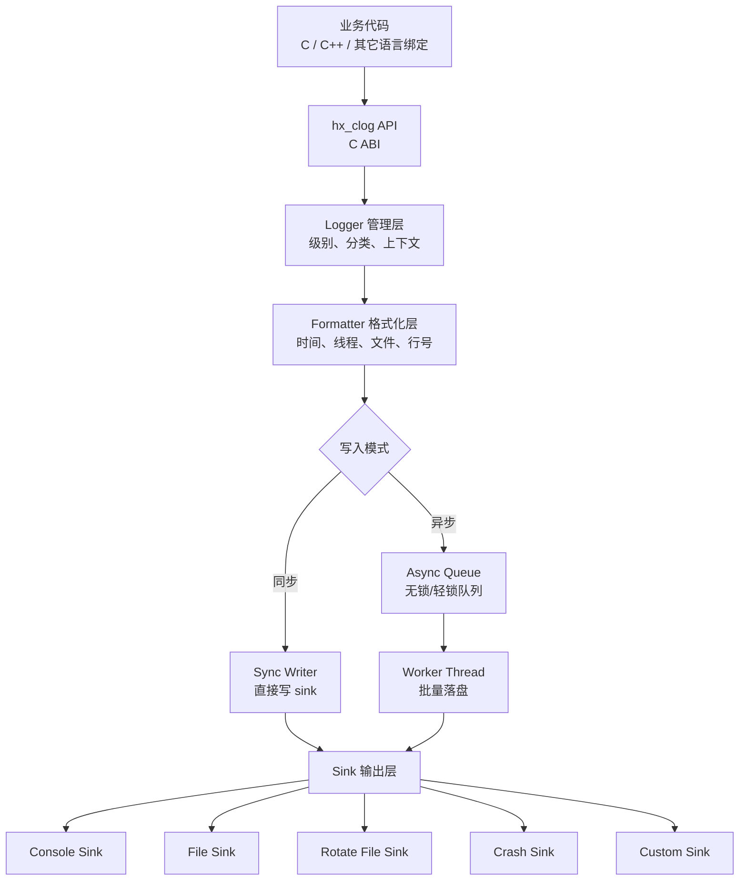

### 2.2 核心模块

| 模块 | 职责 |
| --- | --- |
| `hx_clog.h` | 对外 C 接口、宏、类型定义 |
| `hx_clog_core.c` | logger 生命周期、全局配置、级别过滤 |
| `hx_clog_format.c` | 日志格式化、时间格式、线程 ID、源码位置 |
| `hx_clog_sink.c` | sink 抽象层，统一输出接口 |
| `hx_clog_file.c` | 文件打开、写入、flush、fsync、路径处理 |
| `hx_clog_rotate.c` | 日志轮转和历史文件清理 |
| `hx_clog_async.c` | 异步队列、后台线程、批量写入、退出 drain |
| `hx_clog_crash.c` | 崩溃捕获、最后日志保护、调用栈记录 |
| `hx_clog_cpp.hpp` | 可选 C++11 RAII 封装，内部仍调用 C API |

## 3. 推荐目录结构

```text
hx_clog/
├── CMakeLists.txt
├── include/
│   ├── hx_clog.h
│   └── hx_clog_cpp.hpp        # 可选
├── src/
│   ├── hx_clog_core.c
│   ├── hx_clog_format.c
│   ├── hx_clog_sink.c
│   ├── hx_clog_file.c
│   ├── hx_clog_rotate.c
│   ├── hx_clog_async.c
│   └── hx_clog_crash.c
├── cmake/
│   └── hx_clogConfig.cmake.in
├── examples/
│   ├── c_basic.c
│   ├── c_async.c
│   ├── c_rotate.c
│   └── cpp11_basic.cpp
├── tests/
│   ├── test_format.c
│   ├── test_rotate.c
│   ├── test_async.c
│   └── test_crash.c
└── docs/
    ├── api.md
    ├── design.md
    └── crash.md
```

## 4. 日志级别

建议提供 6 个常用级别，并保留关闭日志的级别：

| 级别 | 典型用途 |
| --- | --- |
| `HX_CLOG_TRACE` | 极细粒度调试信息，例如函数进入/退出 |
| `HX_CLOG_DEBUG` | 开发阶段调试信息 |
| `HX_CLOG_INFO` | 关键业务流程、启动参数、状态变化 |
| `HX_CLOG_WARN` | 可恢复异常、配置缺失、重试 |
| `HX_CLOG_ERROR` | 操作失败、请求失败、资源不可用 |
| `HX_CLOG_FATAL` | 严重错误，可能需要退出程序 |
| `HX_CLOG_OFF` | 关闭日志 |

级别过滤建议尽早发生：

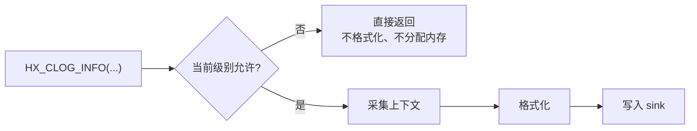

## 5. C API 设计

### 5.1 基础类型

```c
typedef enum hx_clog_level {
    HX_CLOG_LEVEL_TRACE = 0,
    HX_CLOG_LEVEL_DEBUG,
    HX_CLOG_LEVEL_INFO,
    HX_CLOG_LEVEL_WARN,
    HX_CLOG_LEVEL_ERROR,
    HX_CLOG_LEVEL_FATAL,
    HX_CLOG_LEVEL_OFF
} hx_clog_level_t;

typedef enum hx_clog_mode {
    HX_CLOG_MODE_SYNC = 0,
    HX_CLOG_MODE_ASYNC
} hx_clog_mode_t;

typedef enum hx_clog_rotate_policy {
    HX_CLOG_ROTATE_NONE = 0,
    HX_CLOG_ROTATE_BY_SIZE,
    HX_CLOG_ROTATE_BY_TIME,
    HX_CLOG_ROTATE_BY_SIZE_AND_TIME
} hx_clog_rotate_policy_t;
```

### 5.2 配置结构

```c
typedef struct hx_clog_config {
    const char* logger_name;       /* 默认 "hx_clog" */
    const char* log_dir;           /* 默认 "./logs" */
    const char* file_name;         /* 默认 "app.log" */
    hx_clog_level_t level;         /* 默认 INFO */
    hx_clog_mode_t mode;           /* 默认 SYNC */

    int enable_console;            /* 默认 1 */
    int enable_file;               /* 默认 1 */
    int enable_color;              /* 默认 1，仅控制台 */
    int enable_crash_handler;      /* 默认 0，显式开启 */

    hx_clog_rotate_policy_t rotate_policy;
    unsigned long long max_file_size;  /* 例如 10 * 1024 * 1024 */
    int max_backup_files;              /* 例如 10 */
    int rotate_daily;                  /* 是否按天切分 */

    unsigned int async_queue_size;     /* 默认 8192 */
    unsigned int async_batch_size;     /* 默认 64 */
    unsigned int flush_interval_ms;    /* 默认 1000 */

    const char* pattern;               /* 默认内置格式 */
} hx_clog_config_t;
```

> **关于目录与文件名**
>
> - `log_dir` 支持多级相对/绝对路径（如 `"test/logs"`、`"./var/log/app"`），
>   `hx_clog_init()` 时会**自动递归创建**所有不存在的中间目录（`/` 和 `\`
>   两种分隔符都识别，已存在的目录会跳过）。
> - `file_name` 应当是**纯文件名**（如 `"app.log"`），不要把子目录塞进
>   `file_name`。需要子目录时请写到 `log_dir` 里：
>   ```c
>   cfg.log_dir   = "test/logs";   /* 会递归创建 test、test/logs */
>   cfg.file_name = "xxx.log";
>   ```

### 5.3 生命周期接口

```c
int hx_clog_init(const hx_clog_config_t* config);
void hx_clog_shutdown(void);
void hx_clog_flush(void);

void hx_clog_set_level(hx_clog_level_t level);
hx_clog_level_t hx_clog_get_level(void);

int hx_clog_reopen(void);  /* logrotate 或外部移动文件后重新打开 */
```

### 5.4 写日志接口

```c
void hx_clog_write(
    hx_clog_level_t level,
    const char* file,
    int line,
    const char* func,
    const char* fmt,
    ...
);

void hx_clog_writev(
    hx_clog_level_t level,
    const char* file,
    int line,
    const char* func,
    const char* fmt,
    va_list args
);
```

### 5.5 推荐宏

```c
#define HX_LOG_TRACE(fmt, ...) \
    hx_clog_write(HX_CLOG_LEVEL_TRACE, __FILE__, __LINE__, __func__, fmt, ##__VA_ARGS__)

#define HX_LOG_DEBUG(fmt, ...) \
    hx_clog_write(HX_CLOG_LEVEL_DEBUG, __FILE__, __LINE__, __func__, fmt, ##__VA_ARGS__)

#define HX_LOG_INFO(fmt, ...) \
    hx_clog_write(HX_CLOG_LEVEL_INFO, __FILE__, __LINE__, __func__, fmt, ##__VA_ARGS__)

#define HX_LOG_WARN(fmt, ...) \
    hx_clog_write(HX_CLOG_LEVEL_WARN, __FILE__, __LINE__, __func__, fmt, ##__VA_ARGS__)

#define HX_LOG_ERROR(fmt, ...) \
    hx_clog_write(HX_CLOG_LEVEL_ERROR, __FILE__, __LINE__, __func__, fmt, ##__VA_ARGS__)

#define HX_LOG_FATAL(fmt, ...) \
    hx_clog_write(HX_CLOG_LEVEL_FATAL, __FILE__, __LINE__, __func__, fmt, ##__VA_ARGS__)
```

> Windows MSVC 老版本对 `##__VA_ARGS__` 支持不一致时，可以额外提供 `HX_LOG_INFO0("message")` 或使用 C99/C++20 兼容宏方案。

## 6. C 使用示例

### 6.1 最小接入

```c
#include "hx_clog.h"

int main(void) {
    hx_clog_config_t config;
    hx_clog_config_default(&config);

    config.log_dir = "./logs";
    config.file_name = "demo.log";
    config.level = HX_CLOG_LEVEL_INFO;

    if (hx_clog_init(&config) != 0) {
        return 1;
    }

    HX_LOG_INFO("program started, pid=%d", 1234);
    HX_LOG_WARN("config value missing, use default");
    HX_LOG_ERROR("open file failed: %s", "data.txt");

    hx_clog_shutdown();
    return 0;
}
```

### 6.2 异步日志

```c
hx_clog_config_t config;
hx_clog_config_default(&config);

config.mode = HX_CLOG_MODE_ASYNC;
config.async_queue_size = 65536;
config.async_batch_size = 128;
config.flush_interval_ms = 500;

hx_clog_init(&config);
HX_LOG_INFO("async logging enabled");
hx_clog_shutdown(); /* shutdown 时必须 drain 队列 */
```

### 6.3 日志轮转

```c
hx_clog_config_t config;
hx_clog_config_default(&config);

config.rotate_policy = HX_CLOG_ROTATE_BY_SIZE_AND_TIME;
config.max_file_size = 20ULL * 1024ULL * 1024ULL;
config.max_backup_files = 30;
config.rotate_daily = 1;

hx_clog_init(&config);
```

## 7. C++11 可选封装

C++11 封装层建议只做易用性增强，不重新实现核心逻辑。

### 7.1 RAII 管理

```cpp
#include "hx_clog_cpp.hpp"

int main() {
    hx::clog::Config config;
    config.log_dir = "./logs";
    config.file_name = "cpp_demo.log";
    config.level = HX_CLOG_LEVEL_DEBUG;

    hx::clog::Logger logger(config);

    HX_LOG_INFO("C macro still works");
    logger.info("C++ wrapper message: {}", "hello"); // 可选 fmt 风格
}
```

### 7.2 C++ 封装边界

| 内容 | 建议 |
| --- | --- |
| 生命周期 | 使用 RAII 自动 `init/shutdown` |
| 字符串 | 接受 `std::string`，内部转为 `const char*` |
| 格式化 | 可选接入 `{fmt}`，不开启时仍使用 C `printf` 风格 |
| 异常 | 默认不抛异常，使用错误码；可通过宏开启异常 |
| ABI | 不导出 C++ ABI，库核心保持 C ABI 稳定 |

## 8. 日志格式

### 8.1 默认格式

```text
2026-06-07 15:04:05.123 [INFO ] [tid:12345] main.c:28 main() - server started, port=8080
```

字段说明：

| 字段 | 示例 | 说明 |
| --- | --- | --- |
| 时间 | `2026-06-07 15:04:05.123` | 本地时间，毫秒精度 |
| 级别 | `[INFO ]` | 固定宽度，便于对齐 |
| 线程 | `[tid:12345]` | 多线程定位问题 |
| 源码 | `main.c:28 main()` | 文件、行号、函数名 |
| 消息 | `server started` | 用户日志内容 |

### 8.2 pattern 语法

建议支持类似如下占位符：

| 占位符 | 含义 |
| --- | --- |
| `%Y-%m-%d %H:%M:%S.%e` | 日期时间，毫秒 |
| `%l` | 日志级别 |
| `%t` | 线程 ID |
| `%p` | 进程 ID |
| `%s` | 源文件名（仅文件名，basename） |
| `%F` | 源文件完整路径（`__FILE__` 原样） |
| `%#` | 行号 |
| `%!` | 函数名 |
| `%v` | 日志正文 |
| `%n` | 换行 |
| `%%` | 字面量百分号 |

示例：

```text
[%Y-%m-%d %H:%M:%S.%e] [%l] [pid:%p tid:%t] [%s:%#] %v%n
```

## 9. 同步日志设计

同步日志是最简单可靠的模式：

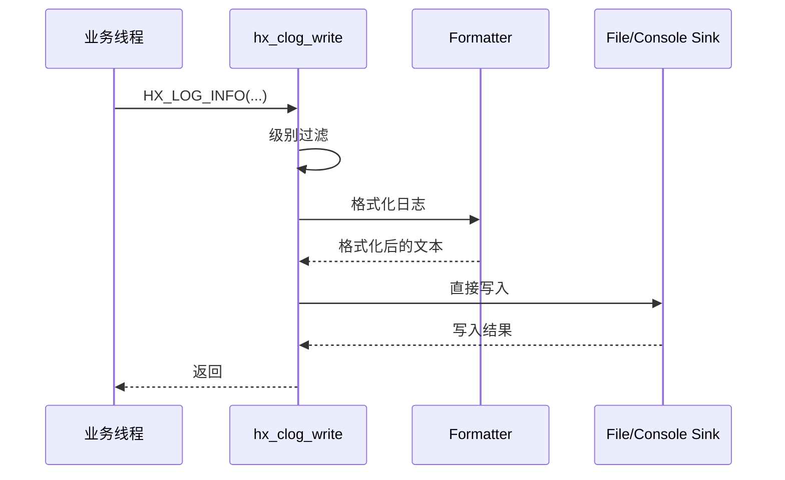

优点：

- 实现简单，行为可预测。
- crash 前最后一条日志更容易落盘。
- 适合 CLI 工具、测试程序、嵌入式小程序。

缺点：

- 文件 IO 可能阻塞业务线程。
- 高频日志场景下吞吐量较低。

## 10. 异步日志设计

异步日志通过队列和后台线程降低调用线程延迟：

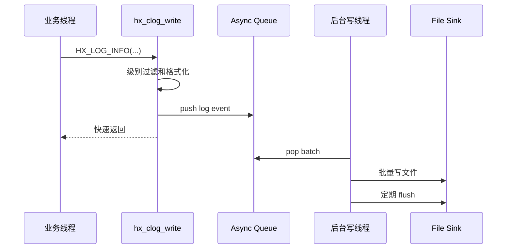

### 10.1 队列策略

异步队列满时建议支持三种策略：

| 策略 | 行为 | 适用场景 |
| --- | --- | --- |
| `BLOCK` | 阻塞业务线程直到有空间 | 不能丢日志的服务端 |
| `DROP_NEW` | 丢弃当前新日志 | 低延迟系统 |
| `DROP_OLD` | 丢弃最旧日志，保留最新状态 | UI、实时系统 |

推荐默认：`BLOCK`，并提供统计计数：

```c
typedef struct hx_clog_stats {
    unsigned long long written_lines;
    unsigned long long dropped_lines;
    unsigned long long rotated_files;
    unsigned long long queue_high_watermark;
} hx_clog_stats_t;

int hx_clog_get_stats(hx_clog_stats_t* stats);
```

### 10.2 异步退出

`hx_clog_shutdown()` 必须做完整收尾：

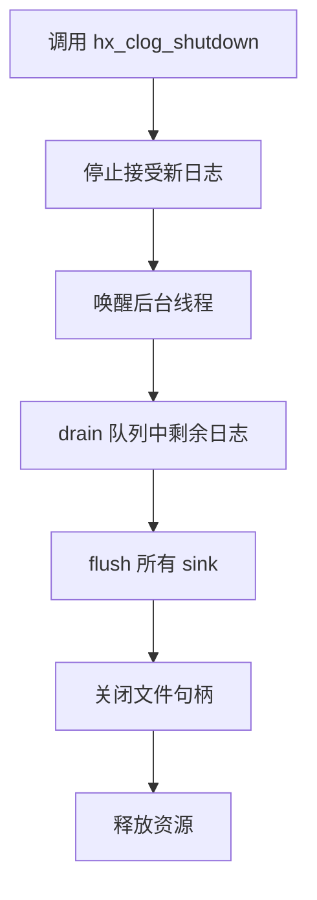

## 11. 日志轮转

### 11.1 轮转策略

日志轮转用于避免单个日志文件无限增长。

| 策略 | 示例 | 说明 |
| --- | --- | --- |
| 按大小 | `app.log` 超过 20MB | 最常用，简单可靠 |
| 按时间 | 每天生成 `app.2026-06-07.log` | 便于按日期归档 |
| 大小 + 时间 | 每天文件内再按大小拆分 | 服务端推荐 |
| 启动轮转 | 每次启动移动旧日志 | 适合客户端工具 |

### 11.2 文件命名

推荐格式：

```text
logs/
├── app.log
├── app.2026-06-07.1.log
├── app.2026-06-07.2.log
├── app.2026-06-06.1.log
└── app.2026-06-05.1.log
```

也可以使用压缩归档：

```text
app.2026-06-06.1.log.gz
```

压缩建议放到后台线程或独立维护线程中做，避免阻塞写日志。

### 11.3 轮转流程

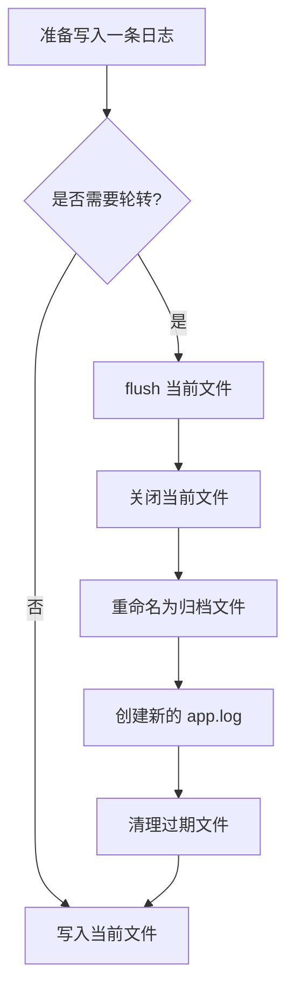

### 11.4 清理规则

建议同时支持：

- 保留最近 N 个文件：`max_backup_files = 30`
- 保留最近 N 天：`max_backup_days = 7`
- 总日志目录大小限制：`max_total_size = 1GB`

清理顺序建议：

1. 先删除超过天数的文件。
2. 再按文件数量删除最旧文件。
3. 最后按目录总大小删除最旧文件。

## 12. Crash 崩溃日志

崩溃处理是日志库的重要增强能力，但必须设计得保守。崩溃发生后，进程状态可能已经损坏，不能假设堆、锁、stdio 都安全。

### 12.1 支持目标

| 平台 | 能力 |
| --- | --- |
| Windows | 捕获 SEH 异常，生成 crash 日志，可选 MiniDump |
| Linux | 捕获 `SIGSEGV`、`SIGABRT`、`SIGFPE`、`SIGILL`、`SIGBUS` |
| macOS | 捕获常见 POSIX signal，预留 Mach exception 扩展 |
| Android | 捕获 signal，可选接入 tombstone / logcat |

### 12.2 Crash 模块职责

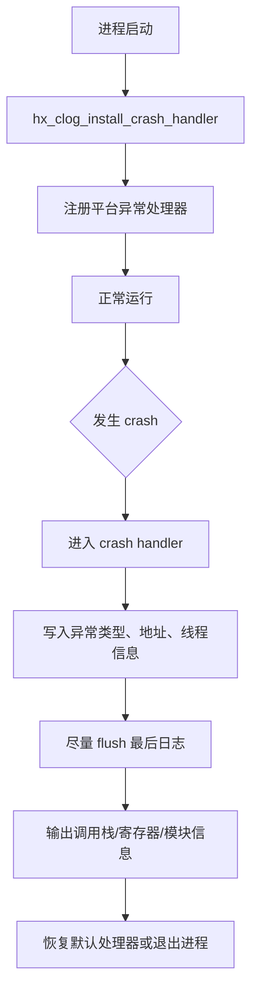

### 12.3 崩溃精确位置与栈追踪

`hx_clog` 的 crash 日志不仅要说明“程序崩了”，还应该尽量说明“在哪里崩了”。理想输出应包含：

- 崩溃类型：例如 `SIGSEGV`、`SIGABRT`、Windows SEH `EXCEPTION_ACCESS_VIOLATION`。
- 崩溃地址：CPU 执行到的 instruction pointer，例如 x86/x64 的 `RIP/EIP`。
- 访问地址：例如空指针访问时的 `fault address = 0x00000000`。
- 崩溃线程：线程 ID、线程名。
- 精确源码位置：函数名、源文件、行号。
- 栈追踪：从崩溃点向上回溯调用链。
- 模块信息：可执行文件、动态库名、模块基址、偏移地址。
- 最近日志：crash 前最后 N 条业务日志。

#### 12.3.1 Crash 日志输出样例

```text
========== hx_clog crash report ==========
time: 2026-06-07 20:45:31.128
process: demo_server
pid: 8342
thread: 12984 (worker-3)

exception:
  type: SIGSEGV
  signal: 11
  reason: address not mapped
  fault_address: 0x0000000000000008
  instruction_pointer: 0x00000001400125af

crash_location:
  module: demo_server
  function: handle_request
  file: D:/project/src/server.c
  line: 218

stacktrace:
  #00 0x00000001400125af demo_server!handle_request
      D:/project/src/server.c:218
  #01 0x0000000140011d34 demo_server!worker_loop
      D:/project/src/worker.c:94
  #02 0x000000014000f820 demo_server!thread_entry
      D:/project/src/thread.c:37
  #03 0x00007ffb11247374 KERNEL32!BaseThreadInitThunk
  #04 0x00007ffb12a1cc91 ntdll!RtlUserThreadStart

last_logs:
  2026-06-07 20:45:30.991 [INFO ] [tid:12984] request id=10021 started
  2026-06-07 20:45:31.003 [DEBUG] [tid:12984] user_id=42, body_size=168
  2026-06-07 20:45:31.127 [WARN ] [tid:12984] request context missing optional field
==========================================
```

> 精确到源码文件和行号需要调试符号。Windows 需要 PDB，Linux/macOS/Android 通常需要 DWARF 调试信息。没有符号时，至少应输出模块名、地址和偏移，方便事后使用符号工具还原。

#### 12.3.2 栈追踪采集流程

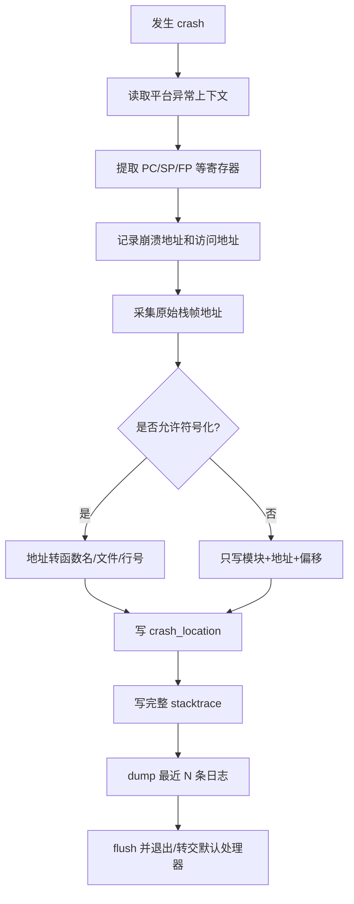

#### 12.3.3 平台实现建议

| 平台 | 采集方式 | 符号化方式 |
| --- | --- | --- |
| Windows | `SetUnhandledExceptionFilter`、Vectored Exception Handler、`CaptureStackBackTrace`、`StackWalk64` | `SymInitialize`、`SymFromAddr`、`SymGetLineFromAddr64`，配合 PDB |
| Linux | `sigaction + SA_SIGINFO` 获取 `ucontext_t`，`backtrace` 或 `libunwind` 回溯 | `dladdr` 获取模块和符号，`addr2line` / `llvm-symbolizer` 根据 DWARF 转文件行号 |
| macOS | `sigaction + ucontext_t`，`backtrace` 或 `_Unwind_Backtrace` | `dladdr`、`atos`、dSYM |
| Android | `sigaction + ucontext_t`，NDK unwinder / `libunwindstack` | tombstone、`ndk-stack`、`llvm-symbolizer` |

推荐实现分两层：

1. **crash handler 内部只采集原始信息**：异常类型、寄存器、PC、SP、FP、模块地址、栈帧地址。
2. **符号化可以延后处理**：优先写 raw address，之后由辅助线程、子进程、外部工具或下次启动时转成文件行号。

这样可以兼顾 crash 场景的安全性和排障信息的完整性。

#### 12.3.4 精确定位所需编译选项

为了让 crash 日志能输出准确的函数、文件和行号，建议 Debug、RelWithDebInfo 和生产可诊断版本都保留调试符号。

| 编译器 | 推荐选项 |
| --- | --- |
| MSVC | `/Zi` 或 `/Z7`，链接时生成 PDB；Release 可使用 `/DEBUG` |
| GCC / Clang | `-g -fno-omit-frame-pointer` |
| MinGW | `-g -fno-omit-frame-pointer` |
| Android NDK | `-g -fno-omit-frame-pointer`，保留 unstripped so 用于符号化 |
| macOS / iOS | `-g`，生成并保留 dSYM |

CMake 可提供诊断选项：

```cmake
option(HX_CLOG_ENABLE_STACKTRACE "Enable crash stacktrace capture" ON)
option(HX_CLOG_ENABLE_SYMBOLIZE "Enable address symbolization" ON)
option(HX_CLOG_KEEP_FRAME_POINTER "Keep frame pointer for better stacktrace" ON)

if(HX_CLOG_KEEP_FRAME_POINTER AND (CMAKE_C_COMPILER_ID MATCHES "GNU|Clang"))
    target_compile_options(hx_clog PUBLIC -fno-omit-frame-pointer)
endif()

if(MSVC)
    target_compile_options(hx_clog PUBLIC /Zi)
    target_link_options(hx_clog PUBLIC /DEBUG)
endif()
```

#### 12.3.5 地址与源码行号映射

当 crash handler 只能安全写出地址时，日志里也要保留足够信息用于事后还原：

```text
#00 module=demo_server base=0x0000000140000000 pc=0x00000001400125af offset=0x125af
```

事后可使用：

```bash
addr2line -e demo_server -f -C 0x125af
llvm-symbolizer -e demo_server 0x125af
```

Windows 可使用 PDB 和 `dbghelp` 在线解析，也可以事后用 Visual Studio、WinDbg 或 symbol server 定位。

### 12.4 Crash API

```c
typedef struct hx_clog_crash_config {
    const char* crash_dir;
    int dump_fault_location;
    int dump_stacktrace;
    int dump_registers;
    int symbolize_stacktrace;
    int stacktrace_max_depth;
    const char* symbol_search_path;
    int create_minidump;       /* Windows 可用 */
    int chain_previous_handler;
} hx_clog_crash_config_t;

int hx_clog_install_crash_handler(const hx_clog_crash_config_t* config);
void hx_clog_uninstall_crash_handler(void);
```

字段建议：

| 字段 | 说明 |
| --- | --- |
| `dump_fault_location` | 输出崩溃点 PC、访问地址、模块偏移、源码位置 |
| `dump_stacktrace` | 输出调用栈 |
| `dump_registers` | 输出寄存器信息，便于底层问题分析 |
| `symbolize_stacktrace` | 尝试把地址解析成函数名、文件、行号 |
| `stacktrace_max_depth` | 最大栈深度，例如 64 或 128 |
| `symbol_search_path` | PDB、dSYM 或 unstripped so 的搜索路径 |
| `create_minidump` | Windows 下生成 `.dmp` 文件 |
| `chain_previous_handler` | 处理后是否继续调用旧 handler |

### 12.5 最后日志缓冲区

为了让 crash 时能看到最近发生了什么，建议维护一个固定大小的环形内存缓冲区：

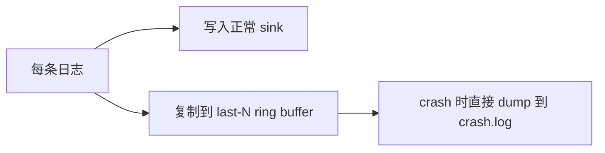

推荐规则：

- 缓冲最近 256 到 4096 条日志。
- 使用预分配内存，避免 crash handler 中 malloc。
- crash handler 中只做尽量安全的低级写入。
- 如果锁不可用，宁愿跳过部分信息，也不要死锁。

### 12.6 Signal 安全建议

POSIX signal handler 中只能调用 async-signal-safe 函数。不要在 signal handler 中调用复杂格式化、`malloc`、`printf`、`pthread_mutex_lock`。

推荐方式：

1. 正常运行时预格式化并保存最后 N 条日志。
2. crash 时使用 `write()` 写入已有字节。
3. 需要完整调用栈时，可以 fork 子进程或在崩溃前预加载 unwinder，但实现复杂度更高。

### 12.7 Windows MiniDump

Windows 下可选支持 `MiniDumpWriteDump`：

```text
crash/
├── crash_20260607_150405.log
└── crash_20260607_150405.dmp
```

建议 CMake 选项：

```cmake
option(HX_CLOG_ENABLE_MINIDUMP "Enable Windows minidump support" ON)
```

## 13. Sink 输出层

Sink 是日志输出目标。所有日志最终都写入一个或多个 sink。

```c
typedef struct hx_clog_sink hx_clog_sink_t;

typedef struct hx_clog_sink_vtable {
    int  (*write)(hx_clog_sink_t* sink, const char* data, unsigned int size);
    int  (*flush)(hx_clog_sink_t* sink);
    void (*close)(hx_clog_sink_t* sink);
} hx_clog_sink_vtable_t;
```

### 13.1 内置 sink

| sink | 说明 |
| --- | --- |
| Console Sink | 输出到 stdout/stderr，按级别着色 |
| File Sink | 输出到固定文件 |
| Rotate File Sink | 自动轮转文件 |
| Crash Sink | 专门写 crash 信息 |
| Callback Sink | 用户自定义处理，例如写入 GUI、网络、数据库 |
| Syslog Sink | Linux/macOS 系统日志，可选 |
| EventLog Sink | Windows Event Log，可选 |
| Android Log Sink | Android logcat，可选 |

### 13.2 自定义 sink

```c
typedef int (*hx_clog_callback_t)(
    hx_clog_level_t level,
    const char* data,
    unsigned int size,
    void* user_data
);

int hx_clog_add_callback_sink(hx_clog_callback_t cb, void* user_data);
```

## 14. 线程安全

`hx_clog` 应保证以下接口线程安全：

| 接口 | 线程安全要求 |
| --- | --- |
| `hx_clog_write` | 必须线程安全 |
| `hx_clog_flush` | 必须线程安全 |
| `hx_clog_set_level` | 使用原子变量 |
| `hx_clog_shutdown` | 只允许调用一次，多次调用应安全返回 |
| sink 写入 | 同步模式下需要内部加锁 |

建议：

- 日志级别使用原子读写，降低热路径开销。
- 同步文件写入使用轻量 mutex。
- 异步模式下业务线程只 push 队列。
- 退出时设置状态位，避免 shutdown 后继续写入导致崩溃。

## 15. 内存管理

日志库常见问题是内存分配过多和异常路径不稳定。建议：

| 场景 | 策略 |
| --- | --- |
| 短日志 | 使用栈上固定缓冲区，例如 1KB 或 2KB |
| 长日志 | 超过栈缓冲区时再动态分配 |
| 异步队列 | 初始化时预分配消息槽 |
| crash ring buffer | 初始化时固定分配，不在 crash 中分配 |
| 自定义 allocator | 允许用户接入内存池 |

可选 allocator API：

```c
typedef void* (*hx_clog_malloc_fn)(unsigned int size, void* user_data);
typedef void  (*hx_clog_free_fn)(void* ptr, void* user_data);

typedef struct hx_clog_allocator {
    hx_clog_malloc_fn malloc_fn;
    hx_clog_free_fn free_fn;
    void* user_data;
} hx_clog_allocator_t;

int hx_clog_set_allocator(const hx_clog_allocator_t* allocator);
```

### 15.1 单条日志大小上限

单条日志的大小处理对**同步和异步模式完全一致**：

| 阶段 | 行为 |
| --- | --- |
| 短日志 | 先写入 1KB 栈缓冲区，零堆分配 |
| 长日志 | 超过栈缓冲区时动态分配，**默认上限 512KB** |
| 异步队列 | 每个队列槽的缓冲区按需增长并复用，可容纳完整的大行（不再截断到固定槽大小） |

> 早期实现中异步模式受固定槽大小限制（单条最多约 512 字节），现已改为
> 按需增长的复用缓冲区，因此**同步和异步都能输出最大 512KB 的单条日志**，
> 且稳态下对常规大小的日志仍是零额外分配。

**取消上限（仅受内存限制）**：开启 CMake 选项 `HX_CLOG_UNLIMITED_LINE` 后，
单条日志不再有固定上限，可增长到进程能分配的最大内存：

```bash
cmake -S . -B build -DHX_CLOG_UNLIMITED_LINE=ON
```

也可以用 `-DHX_CLOG_MAX_LINE_BYTES=<字节数>` 自定义一个具体上限（例如
`-DHX_CLOG_MAX_LINE_BYTES=2097152` 表示 2MB）；该值在开启
`HX_CLOG_UNLIMITED_LINE` 时被忽略。

> 注意：crash 报告中"最近 N 条日志"的环形缓冲区仍为每条 512 字节固定大小
> （崩溃路径需要预分配、不在 crash 中再申请内存），这只影响 crash 报告里的
> 日志回放长度，不影响正常的控制台/文件输出。

## 16. 跨平台 CMake 构建

### 16.0 源码编码与 MSVC UTF-8 选项

本项目所有源码、头文件和文档统一使用 **UTF-8 无 BOM** 编码。

MSVC 默认按系统代码页（如简体中文环境的 GBK/936）解析源文件，遇到 UTF-8
中的非 ASCII 字符会报 `C4819` 警告，甚至导致字符串常量乱码。为避免这一问题，
CMake 中对 MSVC 显式开启 `/utf-8`（同时设置源字符集和执行字符集为 UTF-8），
使编译行为与编码无关，且不依赖系统区域设置：

```cmake
if(MSVC)
    add_compile_options(/utf-8)
endif()
```

该选项放在顶层 `project()` 之后、定义任何 target 之前，因此对库、示例和测试
全部生效。GCC/Clang 默认即按 UTF-8 处理源文件，无需额外选项。

> 约定：提交代码时请保持文件为 UTF-8 无 BOM；不要让编辑器写入 BOM 或保存为
> UTF-16/GBK，否则跨平台编译可能出现告警或乱码。

### 16.1 CMake 目标

建议导出标准 CMake target：

```cmake
find_package(hx_clog CONFIG REQUIRED)
target_link_libraries(my_app PRIVATE hx_clog::hx_clog)
```

### 16.2 顶层 CMakeLists.txt 示例

```cmake
cmake_minimum_required(VERSION 3.16)

project(hx_clog
    VERSION 1.0.0
    DESCRIPTION "A portable C/C++11 logging framework"
    LANGUAGES C CXX
)

option(HX_CLOG_BUILD_SHARED "Build hx_clog as shared library" OFF)
option(HX_CLOG_BUILD_EXAMPLES "Build examples" ON)
option(HX_CLOG_BUILD_TESTS "Build tests" ON)
option(HX_CLOG_ENABLE_CPP11 "Enable C++11 wrapper" ON)
option(HX_CLOG_ENABLE_ASYNC "Enable async logging" ON)
option(HX_CLOG_ENABLE_CRASH "Enable crash handler" ON)
option(HX_CLOG_ENABLE_COLOR "Enable colored console output" ON)
option(HX_CLOG_ENABLE_SYSLOG "Enable syslog sink on Unix" OFF)
option(HX_CLOG_ENABLE_MINIDUMP "Enable minidump on Windows" ON)

set(HX_CLOG_SOURCES
    src/hx_clog_core.c
    src/hx_clog_format.c
    src/hx_clog_sink.c
    src/hx_clog_file.c
    src/hx_clog_rotate.c
)

if(HX_CLOG_ENABLE_ASYNC)
    list(APPEND HX_CLOG_SOURCES src/hx_clog_async.c)
endif()

if(HX_CLOG_ENABLE_CRASH)
    list(APPEND HX_CLOG_SOURCES src/hx_clog_crash.c)
endif()

if(HX_CLOG_BUILD_SHARED)
    add_library(hx_clog SHARED ${HX_CLOG_SOURCES})
else()
    add_library(hx_clog STATIC ${HX_CLOG_SOURCES})
endif()

add_library(hx_clog::hx_clog ALIAS hx_clog)

target_include_directories(hx_clog
    PUBLIC
        $<BUILD_INTERFACE:${CMAKE_CURRENT_SOURCE_DIR}/include>
        $<INSTALL_INTERFACE:include>
)

target_compile_features(hx_clog PUBLIC c_std_99)

if(HX_CLOG_ENABLE_CPP11)
    target_compile_features(hx_clog PUBLIC cxx_std_11)
    target_compile_definitions(hx_clog PUBLIC HX_CLOG_ENABLE_CPP11=1)
endif()

if(HX_CLOG_ENABLE_ASYNC)
    target_compile_definitions(hx_clog PUBLIC HX_CLOG_ENABLE_ASYNC=1)
endif()

if(HX_CLOG_ENABLE_CRASH)
    target_compile_definitions(hx_clog PUBLIC HX_CLOG_ENABLE_CRASH=1)
endif()

if(WIN32)
    target_compile_definitions(hx_clog PRIVATE HX_CLOG_PLATFORM_WINDOWS=1)
    target_link_libraries(hx_clog PRIVATE dbghelp)
elseif(APPLE)
    target_compile_definitions(hx_clog PRIVATE HX_CLOG_PLATFORM_APPLE=1)
    target_link_libraries(hx_clog PRIVATE pthread)
elseif(UNIX)
    target_compile_definitions(hx_clog PRIVATE HX_CLOG_PLATFORM_UNIX=1)
    target_link_libraries(hx_clog PRIVATE pthread)
endif()

include(GNUInstallDirs)

install(TARGETS hx_clog
    EXPORT hx_clogTargets
    ARCHIVE DESTINATION ${CMAKE_INSTALL_LIBDIR}
    LIBRARY DESTINATION ${CMAKE_INSTALL_LIBDIR}
    RUNTIME DESTINATION ${CMAKE_INSTALL_BINDIR}
)

install(DIRECTORY include/ DESTINATION ${CMAKE_INSTALL_INCLUDEDIR})

install(EXPORT hx_clogTargets
    FILE hx_clogTargets.cmake
    NAMESPACE hx_clog::
    DESTINATION ${CMAKE_INSTALL_LIBDIR}/cmake/hx_clog
)
```

### 16.3 常用构建命令

#### Windows MSVC

```powershell
cmake -S . -B build -G "Visual Studio 17 2022" -A x64
cmake --build build --config Release
cmake --install build --config Release --prefix install
```

#### Windows MinGW

```powershell
cmake -S . -B build -G "MinGW Makefiles" -DCMAKE_BUILD_TYPE=Release
cmake --build build
```

#### Linux

```bash
cmake -S . -B build -DCMAKE_BUILD_TYPE=Release
cmake --build build -j
sudo cmake --install build
```

#### macOS

```bash
cmake -S . -B build -DCMAKE_BUILD_TYPE=Release
cmake --build build -j
cmake --install build --prefix ./install
```

#### Android NDK

```bash
cmake -S . -B build-android \
  -DCMAKE_TOOLCHAIN_FILE=$ANDROID_NDK/build/cmake/android.toolchain.cmake \
  -DANDROID_ABI=arm64-v8a \
  -DANDROID_PLATFORM=android-23 \
  -DCMAKE_BUILD_TYPE=Release

cmake --build build-android -j
```

#### iOS

iOS 通常需要外部 toolchain 文件，例如 `ios-cmake`：

```bash
cmake -S . -B build-ios \
  -DCMAKE_TOOLCHAIN_FILE=ios.toolchain.cmake \
  -DPLATFORM=OS64 \
  -DCMAKE_BUILD_TYPE=Release

cmake --build build-ios -j
```

## 17. 导出符号与 ABI

为了支持动态库，建议定义统一导出宏：

```c
#if defined(_WIN32)
#  if defined(HX_CLOG_BUILD_SHARED)
#    if defined(HX_CLOG_EXPORTS)
#      define HX_CLOG_API __declspec(dllexport)
#    else
#      define HX_CLOG_API __declspec(dllimport)
#    endif
#  else
#    define HX_CLOG_API
#  endif
#else
#  if defined(HX_CLOG_BUILD_SHARED)
#    define HX_CLOG_API __attribute__((visibility("default")))
#  else
#    define HX_CLOG_API
#  endif
#endif
```

ABI 稳定建议：

- 对外只暴露 C 函数。
- 结构体增加 `size` 字段或版本字段，便于未来兼容扩展。
- 不在 ABI 中暴露 C++ 类型。
- 不要求调用方和库使用同一个 C++ STL。

## 18. 错误码设计

```c
typedef enum hx_clog_result {
    HX_CLOG_OK = 0,
    HX_CLOG_ERR_INVALID_ARGUMENT = -1,
    HX_CLOG_ERR_NOT_INITIALIZED = -2,
    HX_CLOG_ERR_ALREADY_INITIALIZED = -3,
    HX_CLOG_ERR_OPEN_FILE_FAILED = -4,
    HX_CLOG_ERR_OUT_OF_MEMORY = -5,
    HX_CLOG_ERR_THREAD_FAILED = -6,
    HX_CLOG_ERR_QUEUE_FULL = -7,
    HX_CLOG_ERR_PLATFORM = -8
} hx_clog_result_t;
```

建议提供：

```c
const char* hx_clog_strerror(int err);
```

## 19. 配置文件支持

基础库不一定必须读取配置文件，但可以提供可选扩展。

### 19.1 INI 示例

```ini
[hx_clog]
level=info
mode=async
log_dir=./logs
file_name=app.log
enable_console=true
enable_file=true
rotate_policy=size_and_time
max_file_size=20971520
max_backup_files=30
flush_interval_ms=500
```

### 19.2 环境变量

建议支持环境变量覆盖：

| 变量 | 说明 |
| --- | --- |
| `HX_CLOG_LEVEL` | 覆盖日志级别 |
| `HX_CLOG_DIR` | 覆盖日志目录 |
| `HX_CLOG_MODE` | `sync` 或 `async` |
| `HX_CLOG_CONSOLE` | 是否开启控制台 |

## 20. 性能设计

### 20.1 热路径优化

日志热路径需要尽可能短：

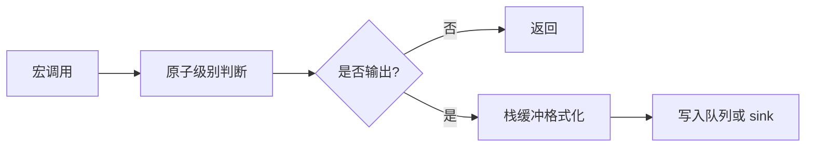

推荐优化：

- 级别过滤在格式化之前。
- 常见日志使用栈缓冲区，避免堆分配。
- 异步模式批量写入，减少系统调用。
- 文件写入使用 buffered IO 或平台原生批量写入。
- 可选禁用源码文件、函数名等字段减少开销。

### 20.2 Benchmark 指标

建议测试：

| 指标 | 说明 |
| --- | --- |
| 单线程同步吞吐 | 每秒写入日志条数 |
| 多线程同步吞吐 | 多线程锁竞争表现 |
| 异步入队延迟 | `HX_LOG_INFO` 平均耗时 |
| 异步总吞吐 | 后台线程实际落盘速度 |
| 丢日志计数 | 队列满时行为是否符合预期 |
| crash flush 成功率 | 崩溃时最后日志保留情况 |

## 21. 安全性与可靠性

| 问题 | 设计建议 |
| --- | --- |
| 多线程同时初始化 | 使用一次性初始化保护 |
| shutdown 后继续写日志 | 返回错误或写到 fallback stderr |
| 磁盘满 | 输出错误计数，避免死循环 |
| 文件被外部删除 | 定期检测 inode/句柄，支持 `hx_clog_reopen` |
| 队列满 | 根据策略阻塞或丢弃，并统计 |
| fork 后状态异常 | Unix 下提供 `hx_clog_after_fork_child` |
| crash handler 死锁 | crash 路径避免普通 mutex 和 malloc |

## 22. 测试计划

### 22.1 单元测试

| 测试 | 重点 |
| --- | --- |
| 格式化测试 | 时间、级别、线程、文件、行号格式正确 |
| 级别过滤测试 | 低级别日志不会被格式化和写入 |
| 文件写入测试 | 文件创建、追加、flush、关闭 |
| 轮转测试 | 大小轮转、时间轮转、清理旧文件 |
| 异步测试 | 队列、后台线程、shutdown drain |
| 多线程测试 | 并发写入不崩溃、不乱序到不可接受 |
| crash 测试 | 触发崩溃后生成 crash 文件 |

### 22.2 集成测试

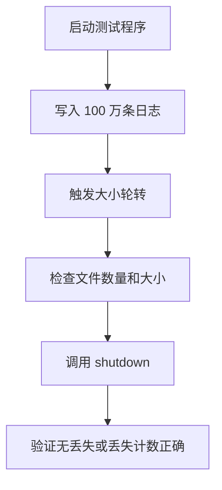

### 22.3 CI 平台建议

| 平台 | 编译器 |
| --- | --- |
| Windows | MSVC、MinGW |
| Linux | GCC、Clang |
| macOS | AppleClang |
| Android | NDK Clang |

## 23. 与常见日志库能力对齐

| 能力 | hx_clog 建议 | 说明 |
| --- | --- | --- |
| 多级别日志 | 必须支持 | 日志库基础能力 |
| 彩色控制台 | 支持 | 提升开发体验 |
| 文件日志 | 必须支持 | 生产环境必需 |
| 轮转日志 | 必须支持 | 对齐成熟日志库 |
| 异步日志 | 支持 | 高频日志场景核心能力 |
| 自定义 sink | 支持 | 方便扩展到 GUI、网络、数据库 |
| crash 日志 | 强烈建议 | 相比普通日志库更有排障价值 |
| C ABI | 默认支持 | 更适合底层库和跨语言 |
| C++11 wrapper | 可选支持 | 增强 C++ 项目易用性 |
| Header-only | 不建议作为默认 | crash、async、文件模块更适合编译库 |

## 24. 推荐默认配置

```c
void hx_clog_config_default(hx_clog_config_t* config) {
    memset(config, 0, sizeof(*config));
    config->logger_name = "hx_clog";
    config->log_dir = "./logs";
    config->file_name = "app.log";
    config->level = HX_CLOG_LEVEL_INFO;
    config->mode = HX_CLOG_MODE_SYNC;
    config->enable_console = 1;
    config->enable_file = 1;
    config->enable_color = 1;
    config->enable_crash_handler = 0;
    config->rotate_policy = HX_CLOG_ROTATE_BY_SIZE_AND_TIME;
    config->max_file_size = 10ULL * 1024ULL * 1024ULL;
    config->max_backup_files = 10;
    config->rotate_daily = 1;
    config->async_queue_size = 8192;
    config->async_batch_size = 64;
    config->flush_interval_ms = 1000;
    config->pattern = "%Y-%m-%d %H:%M:%S.%e [%l] [tid:%t] %s:%# %!() - %v%n";
}
```

## 25. 开发路线图

### 第一阶段：可用

- C API。
- 控制台输出。
- 普通文件输出。
- 日志级别过滤。
- 基础格式化。
- CMake 静态库构建。

### 第二阶段：好用

- 日志轮转。
- 异步日志。
- 彩色控制台。
- 自定义 pattern。
- 多平台 CI。
- 示例和测试。

### 第三阶段：可靠

- crash handler。
- 最后 N 条日志 ring buffer。
- Windows MiniDump。
- Unix signal crash log。
- 磁盘满、外部删除、reopen 等异常路径处理。

### 第四阶段：可扩展

- 自定义 sink。
- syslog / EventLog / Android logcat。
- C++11 RAII wrapper。
- 配置文件加载。
- 性能 benchmark。

## 26. 最小可落地 API 清单

如果先做一个小而完整的版本，建议至少实现：

```c
void hx_clog_config_default(hx_clog_config_t* config);
int hx_clog_init(const hx_clog_config_t* config);
void hx_clog_shutdown(void);
void hx_clog_flush(void);
void hx_clog_set_level(hx_clog_level_t level);
hx_clog_level_t hx_clog_get_level(void);
void hx_clog_write(
    hx_clog_level_t level,
    const char* file,
    int line,
    const char* func,
    const char* fmt,
    ...
);
```

宏：

```c
HX_LOG_TRACE(...)
HX_LOG_DEBUG(...)
HX_LOG_INFO(...)
HX_LOG_WARN(...)
HX_LOG_ERROR(...)
HX_LOG_FATAL(...)
```

这样第一版就可以满足多数项目的实际接入需求，后续再逐步加入异步、轮转、crash 和 C++11 封装。

## 27. 推荐实现优先级


## 28. 总结

`hx_clog` 的核心思路是：

- **C API 做底座**：稳定、轻量、跨语言。
- **同步模式保证简单可靠**：第一版优先落地。
- **异步模式解决性能问题**：队列、后台线程、批量 flush。
- **轮转解决生产可维护性**：按大小、日期和保留策略管理文件。
- **crash 能力解决关键排障问题**：保存最后日志、异常信息和调用栈。
- **CMake 做跨平台入口**：Windows、Linux、macOS、Android、iOS 都能统一构建。

按这个架构推进，`hx_clog` 可以从一个简单的 C 日志库逐步成长为一个接近成熟商用/开源日志框架能力的基础组件。
